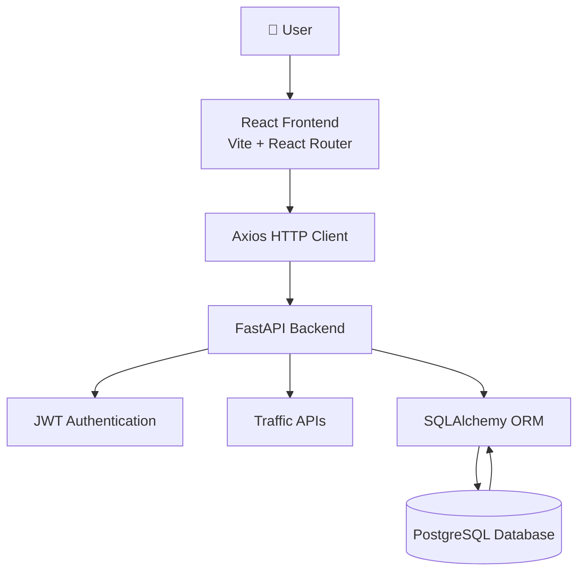

# 🚦 TrafficVision AI

### Smart Traffic Monitoring & Congestion Management System

_A full-stack web application for real-time traffic monitoring, secure user authentication, and intelligent traffic management, built using React, FastAPI, and PostgreSQL._

## 📖 Project Description

TrafficVision AI is a full-stack Smart Traffic Monitoring and Congestion Management System developed to improve urban traffic management through real-time monitoring, secure access control, and data-driven decision making.

The project is being developed as part of an internship to simulate a modern intelligent transportation system using a scalable client-server architecture. It combines a React frontend, a FastAPI backend, and a PostgreSQL database to provide a secure and interactive web application.

The current implementation includes user authentication using JWT, role-based access control, live traffic monitoring through an interactive dashboard, and seamless integration between the frontend, backend, and database. Future milestones will extend the system with AI-based traffic prediction, route optimization, analytics, and real-time alerting.

## 🚧 Project Status

**Completed Milestone:** Week 1 & 2 – Project Initialization, Design Process & Core Setup

**Current Milestone:** Week 3 & 4 – Traffic Prediction & Route Optimization

### ✅ Completed

- Project architecture and folder structure
- Backend setup using FastAPI
- Frontend setup using React (Vite)
- PostgreSQL database integration
- SQLAlchemy ORM configuration
- JWT-based authentication
- Role-Based Access Control (RBAC)
- User Registration and Login
- Protected API endpoints
- Frontend–Backend–Database connectivity
- Live Traffic Monitoring Dashboard
- Traffic summary cards
- Traffic trend chart
- Live traffic table
- Git version control and GitHub repository setup
- Role-specific dashboards (Admin, Traffic Operator, Commuter)
- Dashboard component refactoring
- Dashboard layout architecture
- Public navigation bar
- Improved Login UI
- Improved Register UI
- Dataset selection
- Data quality assessment
- Missing value analysis
- Duplicate analysis
- Exploratory data analysis
  - Traffic volume distribution
  - Area-wise traffic analysis
  - Speed analysis
  - Congestion analysis
  - Weather analysis
  - Correlation analysis

### 🚧 Currently In Progress

- Feature Engineering (In Progress)

### 📅 Upcoming Milestones

- Dataset selection
- Exploratory Data Analysis (EDA)
- Data preprocessing
- Dataset integration with PostgreSQL
- Traffic CRUD operations
- AI-based congestion prediction
- Route optimization
- Analytics and reporting
- Real-time notifications
- Responsive UI
- Docker deployment
- Cloud deployment

## 🎯 Project Objectives

The primary objectives of TrafficVision AI are:

- Develop a scalable full-stack Smart Traffic Management System.
- Monitor traffic conditions in real time through an interactive dashboard.
- Implement secure user authentication using JWT.
- Enforce Role-Based Access Control (RBAC) for different user roles.
- Build a modular and maintainable backend using FastAPI and SQLAlchemy.
- Integrate a PostgreSQL database for reliable data storage and retrieval.
- Establish seamless communication between the frontend, backend, and database.
- Provide a foundation for future AI-based traffic prediction and route optimization.
- Follow industry-standard software development practices, including Git version control, documentation, and modular project architecture.

## ✨ Features

### ✅ Current Features

#### Backend

- FastAPI REST API
- PostgreSQL database integration
- SQLAlchemy ORM
- JWT-based Authentication
- OAuth2 Password Flow
- Role-Based Access Control (RBAC)
- Environment variable configuration using `.env`
- Modular project architecture
- Protected API endpoints

#### Frontend

- React + Vite application
- React Router navigation
- Axios API integration
- Protected routes
- User Login
- Basic Home Page
- Basic Register Page
- Dashboard

#### Dashboard

- Live Traffic Monitoring
- Traffic Summary Cards
- Traffic Trend Chart
- Live Traffic Data Table
- Logged-in User Information
- Logout Functionality
- Dashboard Layout
- Dashboard Header
- Dashboard Cards
- Dashboard Content
- Role-specific dashboards

#### Development

- Git version control
- GitHub repository
- README documentation
- Modular folder structure

---

### 🚀 Planned Features

- Traffic Data CRUD Operations
- Traffic Analytics
- AI-Based Congestion Prediction
- Route Optimization
- Interactive Maps Integration
- Real-Time Notifications
- Docker Containerization
- Cloud Deployment

## 🛠️ Technology Stack

| Category              | Technologies                                |
| --------------------- | ------------------------------------------- |
| **Frontend**          | React, Vite, React Router, Axios            |
| **Backend**           | FastAPI, SQLAlchemy, Pydantic               |
| **Database**          | PostgreSQL                                  |
| **Authentication**    | JWT, OAuth2 Password Flow, Passlib (bcrypt) |
| **Development Tools** | Git, GitHub, VS Code, pgAdmin               |
| **Configuration**     | Python Virtual Environment, python-dotenv   |

## 📊 Machine Learning Workflow

TrafficVision AI follows a structured data science pipeline before integrating machine learning into the application.

1. Dataset Collection
2. Dataset Evaluation
3. Exploratory Data Analysis (EDA)
4. Data Cleaning
5. Feature Engineering
6. Data Visualization
7. PostgreSQL Integration
8. Machine Learning Model Training
9. Model Evaluation
10. Prediction API Development
11. Dashboard Integration

## 🏗️ System Architecture



## 📁 Project Structure

```text
TrafficVision-AI/
│
├── backend/
│   ├── app/
│   │   ├── config/              # Application configuration
│   │   ├── database/            # Database connection & ORM base
│   │   ├── dependencies/        # Authentication & authorization dependencies
│   │   ├── models/              # SQLAlchemy database models
│   │   ├── routers/             # API route definitions
│   │   ├── schemas/             # Pydantic request/response schemas
│   │   ├── utils/               # Security & helper utilities
│   │   └── main.py              # FastAPI application entry point
│   │
│   ├── requirements.txt
│   ├── README.md
│   └── .env
│
├── frontend/
│   ├── public/
│   ├── src/
│   │   ├── assets/
│   │   ├── components/
│   │   │   └── dashboard/
│   │   ├── pages/
│   │   │   ├── admin/
│   │   │   ├── operator/
│   │   │   └── commuter/
│   │   ├── services/
│   │   ├── styles/
│   │   ├── App.jsx
│   │   └── main.jsx
│   │
│   ├── package.json
│   ├── vite.config.js
│   └── README.md
│
├── .gitignore
├── LICENSE
└── README.md
```

## 🚀 Getting Started

### 📋 Prerequisites

Before running the project, ensure the following software is installed on your system:

| Software           | Recommended Version |
| ------------------ | ------------------- |
| Python             | 3.12 or later       |
| Node.js            | 20.x LTS or later   |
| PostgreSQL         | 16 or later         |
| Git                | Latest Version      |
| Visual Studio Code | Latest Version      |

### Recommended VS Code Extensions

- Python
- Pylance
- ESLint
- Prettier
- PostgreSQL (optional)

### ⚙️ Backend Setup

1. Clone the repository:

```bash
git clone https://github.com/springboardmentor620-ai/trafficvision-ai-smart-traffic-prediction.git

cd TrafficVision-AI
```

2. Navigate to the backend directory:

```bash
cd backend
```

3. Create a Python virtual environment:

```bash
python -m venv venv
```

4. Activate the virtual environment:

**Windows (PowerShell):**

```powershell
venv\Scripts\Activate.ps1
```

**Windows (Command Prompt):**

```cmd
venv\Scripts\activate
```

**Linux/macOS:**

```bash
source venv/bin/activate
```

5. Install the required dependencies:

```bash
pip install -r requirements.txt
```

### 🗄️ Database Setup

1. Start the PostgreSQL server.

2. Create a new database:

```sql
CREATE DATABASE trafficvision_db;
```

3. Verify that the database has been created successfully using pgAdmin or the PostgreSQL command line.

4. Configure the database connection in the `.env` file (explained in the next section).

5. The required tables will be created automatically when the FastAPI application starts for the first time.

````

### 💻 Frontend Setup

1. Open a new terminal.

2. Navigate to the frontend directory:

```bash
cd frontend
````

3. Install all required dependencies:

```bash
npm install
```

4. Start the React development server:

```bash
npm run dev
```

5. Open your browser and visit:

```text
http://localhost:5173
```

The frontend will automatically connect to the FastAPI backend if both applications are running.

### 🔐 Environment Variables

Create a `.env` file inside the `backend` directory and configure the following variables:

```env
DATABASE_URL=postgresql://<username>:<password>@localhost:5432/trafficvision_db

SECRET_KEY=your_secret_key_here

ALGORITHM=HS256

ACCESS_TOKEN_EXPIRE_MINUTES=30
```

> **Note:** Never commit your `.env` file to GitHub. Ensure it is included in `.gitignore` to keep sensitive information secure.

### ▶️ Running the Application

To run the complete application, start the backend and frontend in separate terminals.

### Start the Backend

```bash
cd backend

python -m uvicorn app.main:app --reload
```

The backend will be available at:

```text
http://localhost:8000
```

### Start the Frontend

```bash
cd frontend

npm run dev
```

The frontend will be available at:

```text
http://localhost:5173
```

Once both services are running, open your browser and visit:

```text
http://localhost:5173
```

to access the TrafficVision AI application.

### 📖 API Documentation

FastAPI automatically generates interactive API documentation.

After starting the backend, the documentation can be accessed at:

### Swagger UI

```text
http://localhost:8000/docs
```

### ReDoc

```text
http://localhost:8000/redoc
```

These interfaces allow you to:

- View all available API endpoints.
- Test APIs directly from the browser.
- Inspect request and response schemas.
- Verify authentication and authorization workflows.

## 🌐 API Overview

### 🔐 Authentication APIs

| Method | Endpoint    | Access | Description                                         |
| ------ | ----------- | ------ | --------------------------------------------------- |
| POST   | `/register` | Public | Register a new user                                 |
| POST   | `/login`    | Public | Authenticate a user and generate a JWT access token |

---

### 👤 User APIs

| Method | Endpoint | Access        | Description                                     |
| ------ | -------- | ------------- | ----------------------------------------------- |
| GET    | `/me`    | Authenticated | Retrieve the currently logged-in user's profile |
| GET    | `/users` | Admin Only    | Retrieve the list of all registered users       |

## 📅 Development Progress

The development of TrafficVision AI has been carried out in multiple phases, with each phase focusing on a specific aspect of the system before progressing to the next.

### 🚀 Phase 1: Project Initialization

**Completed**

- Selected the project technology stack.
- Created the GitHub repository.
- Organized the frontend and backend project structure.
- Configured the development environment.
- Installed Python, PostgreSQL, pgAdmin, Node.js, and Git.
- Created the Python virtual environment.
- Installed backend and frontend dependencies.

---

### 🗄️ Phase 2: Backend & Database Development

**Completed**

- Developed the FastAPI backend.
- Connected FastAPI with PostgreSQL.
- Configured SQLAlchemy ORM.
- Created the User model.
- Configured database connectivity.
- Implemented automatic table creation.
- Tested backend APIs.

---

### 🔐 Phase 3: Authentication & Authorization

**Completed**

- User Registration
- User Login
- Password Hashing
- JWT Authentication
- OAuth2 Password Flow
- Role-Based Access Control (RBAC)
- Protected API Endpoints

---

### 💻 Phase 4: Frontend Development

**Completed**

- Created the React application using Vite.
- Configured React Router.
- Integrated Axios for API communication.
- Implemented Protected Routes.
- Connected the frontend with backend APIs.
- Stored JWT tokens securely in Local Storage.

---

### 📊 Phase 5: Dashboard Development

**Completed**

- Designed the initial dashboard layout.
- Integrated live traffic APIs.
- Added traffic summary cards.
- Added traffic trend visualization.
- Added live traffic data table.
- Displayed authenticated user information.

---

### 📊 Phase 6: Dashboard Architecture

**Completed**

- Dashboard Layout
- Dashboard Header
- Dashboard Cards
- Dashboard Content
- Dashboard Refactoring

---

### 📈 Phase 7: Data Engineering

**In Progress**

- Dataset Evaluation
- Exploratory Data Analysis (EDA)
- Data Cleaning
- Feature Engineering

## 🛠️ Problems Faced & Solutions

During the development of TrafficVision AI, several technical challenges were encountered and resolved. Documenting these issues helps future contributors understand the development process and provides troubleshooting guidance.

| Problem                                                | Solution                                                                                                 |
| ------------------------------------------------------ | -------------------------------------------------------------------------------------------------------- |
| Python environment setup and PATH configuration        | Installed Python correctly, configured the virtual environment, and verified the Python installation.    |
| PostgreSQL connection issues                           | Configured PostgreSQL correctly and verified the database connection before integrating it with FastAPI. |
| SQLAlchemy database configuration                      | Organized the database layer into a dedicated module and configured session management.                  |
| Missing database driver (`psycopg`)                    | Installed the required PostgreSQL driver and updated the database connection string.                     |
| Environment variable management                        | Moved sensitive configuration values to a `.env` file using `python-dotenv`.                             |
| CORS errors between React and FastAPI                  | Configured FastAPI CORS middleware to allow frontend requests during development.                        |
| OAuth2 authentication (422 Validation Error)           | Updated the frontend login request to use the correct `OAuth2PasswordRequestForm` format.                |
| JWT authentication issues                              | Implemented secure token generation, validation, and protected API endpoints.                            |
| Frontend–Backend communication                         | Configured Axios with a reusable API service and verified backend connectivity.                          |
| Dashboard data integration                             | Replaced static frontend data with live data retrieved from backend APIs.                                |
| Large dashboard component became difficult to maintain | Refactored the dashboard into reusable React components following component-based architecture.          |

## 🧪 Testing

The following components have been tested during development to ensure the application functions as expected.

| Component                    | Status    | Testing Method                                                            |
| ---------------------------- | --------- | ------------------------------------------------------------------------- |
| Backend API                  | ✅ Passed | Tested using FastAPI Swagger UI (`/docs`)                                 |
| Database Connection          | ✅ Passed | Verified PostgreSQL connectivity and CRUD operations                      |
| User Registration            | ✅ Passed | Successfully created new user accounts                                    |
| User Login                   | ✅ Passed | JWT token generated after successful authentication                       |
| Protected APIs               | ✅ Passed | Verified access using JWT authentication                                  |
| Role-Based Access Control    | ✅ Passed | Tested Admin and User authorization                                       |
| Frontend–Backend Integration | ✅ Passed | Verified Axios communication with FastAPI                                 |
| Dashboard                    | ✅ Passed | Successfully displayed live traffic data from PostgreSQL                  |
| Authentication Flow          | ✅ Passed | Verified login, token storage, protected routes, and logout functionality |
| Role-Based Dashboards        | ✅ Passed | Verified navigation and access for Admin, Traffic Operator, and Commuter  |

## 🗺️ Roadmap

The following enhancements are planned for future phases of TrafficVision AI:

### 🎨 User Interface

- Professional Home Page
- Modern Login & Registration Pages
- Responsive Dashboard
- Improved Navigation & Sidebar
- Dark Mode Support

### 🚦 Traffic Management

- Traffic Data CRUD Operations
- Zone Management
- Incident Reporting
- Traffic History
- Interactive Maps Integration

### 🤖 Artificial Intelligence

- Traffic Congestion Prediction
- Route Optimization
- Traffic Pattern Analysis
- Predictive Analytics
- Dataset Evaluation
- Exploratory Data Analysis (EDA)
- Feature Engineering
- Model Training
- Model Evaluation

### 📊 Analytics & Reporting

- Interactive Charts
- Historical Traffic Analysis
- Downloadable Reports
- Performance Dashboard

### ☁️ Deployment & DevOps

- Docker Containerization
- Cloud Deployment
- CI/CD Pipeline
- Environment-based Configuration

### 🔒 Security & Performance

- Refresh Tokens
- Rate Limiting
- API Optimization
- Database Performance Tuning

## 📄 License

This project is licensed under the **MIT License**.

You are free to use, modify, and distribute this project in accordance with the terms of the license.

For more information, see the [LICENSE](LICENSE) file.

## 🙏 Acknowledgements

This project has been developed as part of an internship to gain practical experience in full-stack web development and modern software engineering practices.

Special thanks to:

- The internship mentors for providing project guidance and requirements.
- The open-source community for maintaining the tools and frameworks used in this project.
- The developers and maintainers of FastAPI, React, PostgreSQL, SQLAlchemy, Vite, and other open-source libraries that made this project possible.
- OpenAI ChatGPT for technical guidance, debugging assistance, architecture discussions, and documentation support throughout the development process.
