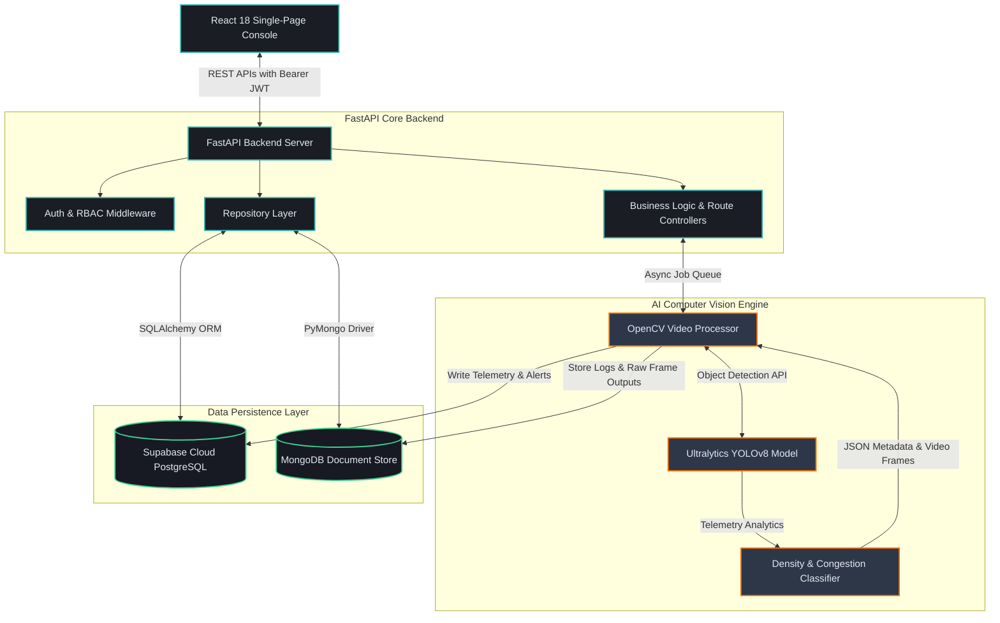

# TrafficVision AI
### AI-Powered Smart Traffic Monitoring & Congestion Management System

[](https://www.python.org/)
[](https://fastapi.tiangolo.com/)
[](https://react.dev/)
[](https://github.com/ultralytics/ultralytics)
[](https://opencv.org/)
[](https://supabase.com/)
[](LICENSE)

> **TrafficVision AI** is an intelligent, full-stack smart city traffic management platform that integrates direct computer vision detection with urban road infrastructure orchestration. By combining state-of-the-art AI-powered vehicle detection, density estimation, and congestion classification with real-time operator management, the platform automates traffic monitoring and enables rapid, data-driven incident response.

---

## 📋 Table of Contents
1. [Project Overview](#-project-overview)
2. [Problem Statement](#-problem-statement)
3. [Solution](#-solution)
4. [Key Features](#-key-features)
5. [System Architecture](#-system-architecture)
6. [AI Processing Pipeline](#-ai-processing-pipeline)
7. [Technology Stack](#-technology-stack)
8. [Database Schema](#-database-schema)
9. [Implemented Modules & Status](#-implemented-modules--status)
10. [AI Congestion Detection Mechanism](#-ai-congestion-detection-mechanism)
11. [API Overview](#-api-overview)
12. [Installation & Setup](#-installation--setup)
13. [Environment Variables](#-environment-variables)
14. [System Screenshots](#-system-screenshots)
15. [Project Achievements](#-project-achievements)
16. [Future Roadmap](#-future-roadmap)
17. [Contributors](#-contributors)
18. [License](#-license)

---

## 🔍 Project Overview

**TrafficVision AI** is a state-of-the-art urban mobility monitoring console designed to aid city administrators, chief traffic controllers, and field operators. It integrates high-performance AI computer vision models to ingest live or recorded traffic video feeds, extract telemetry, classify vehicles, and automatically determine congestion levels across critical junctions and corridors.

The project implementation is structured across two major completed milestones:
*   **Milestone 1 (Operational Control Core)**: Established the foundational web framework, robust multi-role dashboards (Admin and Operator), secure JWT authentication with Role-Based Access Control (RBAC), and cloud database persistence for managing roads, zones, operator assignments, alerts, and operational reporting.
*   **Milestone 2 (AI Computer Vision Integration)**: Introduced OpenCV-based frame extraction, Ultralytics YOLOv8 vehicle detection models, automated vehicle categorization (cars, buses, trucks, motorcycles), and real-time congestion classification. This milestone binds the computer vision results to the Supabase database to dynamically update dashboard visualizations and populate historical traffic analytics.

---

## ⚠️ Problem Statement

Rapidly expanding metropolitan areas are restricted by outdated traffic supervision systems that depend heavily on human oversight, leading to:
1.  **Manual & Fragmented Monitoring**: Operators must manually watch multiple camera feeds, making it easy to miss developing bottlenecks.
2.  **Delayed Congestion Detection**: Traffic backups are often identified only after significant delays, causing cascading traffic jams.
3.  **Lack of Centralized Operator Management**: No unified tool exists to assign controllers to specific roads, leading to gaps in coverage.
4.  **Slow Incident Response**: Escalations for accidents, stalled vehicles, or blocked lanes rely on manual reporting, slowing emergency response times.
5.  **No Intelligent Congestion Analysis**: Traditional telemetry fails to categorize traffic density based on road capacity and vehicle composition.
6.  **Poor Decision Support**: Traffic planners lack historical analytics and predictive reports to optimize traffic signal timings and plan corridor expansions.

---

## 💡 Solution

TrafficVision AI addresses these challenges with a unified, smart city control center:
*   🔒 **Role-Based Access Control**: Secure separation between administrative command and operator field monitoring.
*   📊 **Real-Time Live Monitoring**: Multi-road telemetry dashboards displaying active vehicle counts, average speeds, and status indicators.
*   🛣️ **Corridor & Operator Management**: Comprehensive administrative interfaces to manage road parameters, map-based coordinates, operators, and active duty assignments.
*   🤖 **AI-Based Vehicle Detection**: Automated computer vision processing of road cameras to count and classify passing vehicles.
*   🚦 **Automatic Congestion Detection**: Smart density scoring that triggers instant critical alerts when capacity thresholds are breached.
*   📈 **Historical Analytics & PDF/CSV Reports**: Comprehensive data visualization that aids urban planners in recognizing bottleneck trends.
*   🖥️ **Centralized Dashboard**: A responsive, dark-mode glassmorphic user interface designed for traffic control rooms and mobile field units.

---

## ✨ Key Features

### 🏢 Milestone 1: Operational Core & Governance
*   **Authentication & Security**:
    *   Secure JSON Web Token (JWT) asymmetric authorization with custom expiration times.
    *   Granular RBAC distinguishing system Admins from field Operators.
*   **Admin Dashboard**:
    *   High-level cards tracking active alerts, operator availability, road status, and average corridor speeds.
    *   System health monitor tracking database connections and latency metrics.
*   **Infrastructure Management**:
    *   **Road Management**: Full CRUD interfaces to add, edit, or archive road corridors, detailing speed limits, length, and lane counts.
    *   **Zone Management**: Grouping roads into distinct geographical perimeters (e.g., North Zone, CBD) with bulk status controls.
*   **Personnel & Duty Orchestration**:
    *   **Operator Management**: Onboard operators, manage profiles, toggle status, and issue auto-generated temporary credentials.
    *   **Assignment Management**: Allocate operators to specific road corridors or transfer them dynamically during shift handovers.
*   **Alerts & Incidents**:
    *   Real-time system-wide alert generation with severity grading (Low, Medium, High, Critical).
    *   Interactive resolution workflows allowing operators to append notes and sign off on resolved issues.
*   **Reporting & Settings**:
    *   Data tables exporting CSV/PDF files summarizing corridor utilization and incident rates.
    *   Global SLA threshold configuring and cache settings customization.

### 🧠 Milestone 2: AI Computer Vision & Analytics
*   **Traffic Video Upload**:
    *   Dedicated file upload endpoint supporting popular formats (`.mp4`, `.avi`, `.mov`) linked to specific road corridors.
*   **Video Processing Engine (OpenCV)**:
    *   Asynchronous background worker executing frame extraction, bounding box drawing, and frame skipping optimizations.
*   **Object Detection & Classification (YOLOv8)**:
    *   Ultralytics YOLOv8 model trained to detect and classify multi-class vehicle objects: **Cars, Buses, Trucks, and Motorcycles**.
*   **Traffic Telemetry Extraction**:
    *   **Vehicle Counting**: Continuous frame-by-frame counting of active vehicles on screen.
    *   **Density Estimation**: Computes road occupancy based on vehicle volume, vehicle weights, and lane capacity.
    *   **Congestion Classification**: Maps densities to categorical levels (`LOW`, `MODERATE`, `HIGH`, `CRITICAL`).
*   **AI Processing Pipeline**:
    *   Automated extraction pipeline outputting processed video overlays with highlighted bounding boxes and vehicle counters.
*   **Supabase Database Auto-Updates**:
    *   Asynchronous DB handlers writing frame results directly back to `traffic_data` and triggering new `alerts` if extreme congestion is detected.
*   **Interactive AI Analytics Console**:
    *   Visualizations showing vehicle volume timelines, classification distribution charts, and hourly congestion comparisons.

---

## 🏗️ System Architecture

TrafficVision AI utilizes a decoupled, modern multi-tier architecture designed to scale with urban edge camera networks:



---

## ⚙️ AI Processing Pipeline

The ingestion and detection pipeline runs asynchronously in the background, ensuring the web interface remains responsive during complex video analysis:

```text
┌─────────────────┐      ┌──────────────────┐      ┌─────────────────────┐
│  Traffic Video  ├─────►│ Frame Extraction ├─────►│    YOLOv8 Object    │
│  (.mp4 / .avi)  │      │   (OpenCV API)   │      │  Detection Model    │
└─────────────────┘      └──────────────────┘      └──────────┬──────────┘
                                                              │
                                                              ▼
┌─────────────────┐      ┌──────────────────┐      ┌─────────────────────┐
│   Congestion    │      │ Traffic Density  │      │  Vehicle Counting   │
│ Classification  │◄─────┤    Estimation    │◄─────┤ & Classification    │
│ (Low->Critical) │      │ (Lane Occupancy) │      │ (Car, Bus, Truck...)│
└────────┬────────┘      └──────────────────┘      └─────────────────────┘
         │
         ▼
┌─────────────────┐      ┌──────────────────┐      ┌─────────────────────┐
│    Supabase     ├─────►│  Web Dashboard   ├─────►│ Historical Traffic  │
│ Database Update │      │  Visualizations  │      │  Analytics Charts   │
└─────────────────┘      └──────────────────┘      └─────────────────────┘
```

---

## 🛠️ Technology Stack

| Layer | Technology | Version | Purpose |
| :--- | :--- | :--- | :--- |
| **Frontend** | React | 18.x | Single Page Application UI structure |
| | Vite | 5.x | High-performance client-side bundler |
| | Tailwind CSS | 3.x | Dark glassmorphism styling & design token system |
| | Axios | 1.x | Client-side HTTP communication & token interceptors |
| **Backend** | FastAPI | 0.110.x | High-throughput asynchronous Python web framework |
| | OpenCV | 4.x | Video stream decoding and annotated frame rendering |
| | Ultralytics YOLOv8| 8.x | Real-time object detection and vehicle classification |
| | SQLAlchemy | 2.x | Object-Relational Mapper (ORM) |
| | Pydantic | 2.x | Secure schema definitions & JSON serialization |
| **Database** | Supabase (PostgreSQL)| 15+ | Relational data persistence & spatial indexing |
| | MongoDB | 6.0+ | Document store tracking raw frame telemetry logs |
| **Security** | PyJWT | 2.8.x | Secure client authorization token management |
| | Bcrypt | 4.x | Cryptographic operator password hashing |

---

## 🗄️ Database Schema

The platform relies on a normalized relational schema hosted on **Supabase PostgreSQL** alongside a secondary telemetry document store on **MongoDB**:

### 🏢 Milestone 1 Tables (Core System)
1.  **`users`**: Manages Admin and Operator system profiles.
    *   `id` (PK), `name`, `email`, `password_hash`, `role` (Admin/Operator), `phone`, `status` (Active/Inactive), `zone`, `shift`, `designation`, `last_login`, `created_at`.
2.  **`roads`**: Defines individual physical corridors monitored.
    *   `id` (PK), `road_code`, `road_name`, `zone`, `zone_id` (FK -> zones), `latitude`, `longitude`, `status`, `length_km`, `lanes`, `speed_limit`, `assigned_operator_id` (FK -> users).
3.  **`zones`**: Organizes city sectors.
    *   `id` (PK), `zone_name`, `zone_code`, `description`, `status`, `center_latitude`, `center_longitude`.
4.  **`operator_road_assignments`**: Logs which operator is supervising which road corridor.
    *   `id` (PK), `operator_id` (FK -> users), `road_id` (FK -> roads), `zone_id` (FK -> zones), `assigned_by`, `assigned_at`, `status`.
5.  **`traffic_data`**: Stores hourly telemetry records.
    *   `id` (PK), `road_id` (FK -> roads), `vehicle_count`, `average_speed`, `congestion_level`, `timestamp`.
6.  **`alerts`**: Tracks incidents and active bottlenecks.
    *   `id` (PK), `road_id` (FK -> roads), `alert_type` (e.g. Congestion Spike, Accident), `severity` (Low, Medium, High, Critical), `status` (Active, Resolved), `assigned_operator_id` (FK -> users), `notes`, `created_at`.
7.  **`system_settings`**: Global configuration key-values.
    *   `id` (PK), `sla_threshold_seconds`, `congestion_speed_threshold`, `logging_level`, `updated_at`.

### 🧠 Milestone 2 Tables (AI Engine & Processing)
8.  **`uploaded_videos`**: Catalog of videos uploaded for analysis.
    *   `id` (PK), `road_id` (FK -> roads), `filename`, `file_path`, `upload_status` (Pending, Processing, Completed, Failed), `uploaded_by` (FK -> users), `uploaded_at`.
9.  **`video_processing_jobs`**: Job queue monitoring processing progress.
    *   `id` (PK), `video_id` (FK -> uploaded_videos), `status` (Queued, Processing, Finished, Error), `progress_percentage`, `error_log`, `started_at`, `completed_at`.
10. **`vehicle_detection_results`**: Frame-by-frame classified detection totals.
    *   `id` (PK), `video_id` (FK -> uploaded_videos), `frame_number`, `car_count`, `bus_count`, `truck_count`, `motorcycle_count`, `total_count`, `timestamp`.
11. **`traffic_predictions`**: Forecasted bottleneck data.
    *   `id` (PK), `road_id` (FK -> roads), `prediction_summary`, `confidence_score`, `prediction_time`, `created_at`.
12. **`ai_processing_logs`**: System diagnostic logging for pipeline evaluation.
    *   `id` (PK), `job_id` (FK -> video_processing_jobs), `log_level`, `message`, `timestamp`.

---

## 📈 Implemented Modules & Status

| Milestone | Module | Features | Status | Verification |
| :--- | :--- | :--- | :---: | :--- |
| **Milestone 1** | **Authentication** | JWT secure token, RBAC for Operator/Admin | ✅ | E2E Integration tests passed |
| | **Dashboards** | Executive Admin stats & scoped Operator views | ✅ | Unit & view tests verified |
| | **Roads** | CRUD operations, spatial coordinates mapping | ✅ | CRUD forms validated |
| | **Zones** | Regional grouping, archiving controls | ✅ | Cascade checks verified |
| | **Operators** | Profile onboarding, temporary auto-password | ✅ | Onboarding test scripts passed |
| | **Assignments** | Dynamic assignment, transfer system, conflict checks | ✅ | Workload distribution verified |
| | **Monitoring** | Auto-refreshing telemetry grid, inspection detail side-panel | ✅ | Sub-second polling test passed |
| | **Alerts** | Queue filter, resolution inputs, severity grading | ✅ | Event logging confirmed |
| | **Reports** | Aggregation summaries, PDF & CSV export | ✅ | File stream export validated |
| | **Settings** | SLA target limits, system logging configs | ✅ | Configuration cache verified |
| **Milestone 2** | **Video Upload** | Chunked files upload, backend security file filtering | ✅ | API multipart tests passed |
| | **Video Process** | Background execution, frame extraction, annotated overlays | ✅ | OpenCV frame extraction confirmed |
| | **Vehicle Detect** | YOLOv8 object detection mapping | ✅ | Ultralytics model pipeline verified |
| | **Vehicle Count**| Multi-lane frame counting algorithms | ✅ | Telemetry validator tested |
| | **Congestion** | Density threshold categorizing (Low -> Critical) | ✅ | SLA alert triggers verified |
| | **Dashboard Integr** | Dynamic chart displays, real-time AI status updates | ✅ | Frontend charts integration verified |
| | **Analytics** | Vehicle classification and volume historical logs | ✅ | Data aggregation query tests passed |

---

## 🚗 AI Congestion Detection Mechanism

The congestion detection logic maps physical vehicle bounding boxes to actionable administrative states:

1.  **Object Classification (YOLOv8)**:
    The model identifies vehicle categories in every frame and applies a custom "Passenger Car Equivalent" (PCE) weight:
    $$\text{PCE Value} = (\text{Cars} \times 1.0) + (\text{Motorcycles} \times 0.5) + (\text{Buses} \times 2.5) + (\text{Trucks} \times 3.0)$$

2.  **Traffic Density Calculation**:
    The system calculates the traffic density coefficient ($\mathcal{D}$) relative to the road's configured attributes:
    $$\mathcal{D} = \frac{\text{PCE Value}}{\text{Lanes} \times \text{Length (km)}} \times 100$$

3.  **Congestion Category Mapping**:
    *   🔴 **Critical**: $\mathcal{D} \ge 85\%$ *(Speed dropping under 20% limit; triggers immediate operator SMS/email alerts)*
    *   🟠 **High**: $60\% \le \mathcal{D} < 85\%$ *(Moderate speed reduction; logs warning alert)*
    *   🟡 **Moderate**: $35\% \le \mathcal{D} < 60\%$ *(Stable flow with minor delays)*
    *   🟢 **Low**: $\mathcal{D} < 35\%$ *(Free-flow traffic conditions)*

---

## 🔌 API Overview

### 🔒 Authentication & Governance APIs
*   `POST /api/v1/auth/login` - Authenticate users and return JWT access token.
*   `GET /api/v1/auth/me` - Fetch profile metadata for the authenticated user.
*   `GET /api/v1/admin/dashboard-stats` - Global aggregate counts for roads, operators, active alerts, and network congestion.
*   `GET /api/v1/operator/dashboard-stats` - Personal dashboard containing assigned road metrics and pending alerts.

### 🛣️ Infrastructure & Assignment APIs
*   `POST /api/v1/roads/` | `GET /api/v1/roads/{id}` - Admin road registration and retrieval.
*   `PUT /api/v1/roads/{id}` | `DELETE /api/v1/roads/{id}` - Modify or delete road corridors.
*   `GET /api/v1/zones/` | `POST /api/v1/zones/` - Manage boundary configurations.
*   `PUT /api/v1/zones/{id}/archive` - Archive a zone and disconnect its child corridors.
*   `POST /api/v1/assignments/` - Assign an operator to a road.
*   `POST /api/v1/assignments/transfer` - Transfer road corridors between operator shifts.

### 🤖 AI Ingestion & Detection APIs (Milestone 2)
*   `POST /api/v1/videos/upload` - Endpoint to upload raw road monitor recordings.
*   `GET /api/v1/videos/jobs` - List video analysis jobs.
*   `GET /api/v1/videos/jobs/{job_id}` - Query processing status, progress percentage, and logs.
*   `GET /api/v1/traffic/monitoring` - Returns real-time traffic statistics compiled from database sensors.
*   `GET /api/v1/traffic/analytics/summary` - Aggregate classification totals and volume charts.
*   `GET /api/v1/traffic/predictions` - Fetch predictive bottlenecks generated by forecasting models.

---

## 🚀 Installation & Setup

Ensure you have the following prerequisites installed on your system:
*   [Python 3.10+](https://www.python.org/downloads/)
*   [Node.js v18+](https://nodejs.org/)
*   [Git](https://git-scm.com/)

### 1. Clone the Repository
```bash
git clone https://github.com/your-username/Traffic-Vision-AI.git
cd Traffic-Vision-AI
```

### 2. Backend Environment Setup
1. Navigate to the backend directory and build a Python virtual environment:
   ```bash
   cd backend
   python -m venv venv
   ```
2. Activate the virtual environment:
   *   **Windows**:
       ```powershell
       .\venv\Scripts\activate
       ```
   *   **macOS / Linux**:
       ```bash
       source venv/bin/activate
       ```
3. Install dependencies including computer vision and machine learning packages:
   ```bash
   pip install -r requirements.txt
   pip install ultralytics opencv-python-headless
   ```

### 3. Frontend Environment Setup
1. Open a new terminal window, navigate to the frontend directory:
   ```bash
   cd frontend
   ```
2. Install npm packages:
   ```bash
   npm install
   ```

### 4. Running the Application

*   **Start the FastAPI Backend Service**:
    ```bash
    cd backend
    uvicorn app.main:app --reload --port 8000
    ```
    *The FastAPI backend will be available at `http://localhost:8000` with interactive Swagger API docs at `http://localhost:8000/docs`.*

*   **Start the React Development Server**:
    ```bash
    cd frontend
    npm run dev
    ```
    *The React application will launch at `http://localhost:5173`.*

*   **Launch the Background AI Processing Module**:
    You can trigger the video processing worker locally to listen for uploaded video files and process them using YOLOv8:
    ```bash
    cd backend
    python -m app.services.video_worker
    ```

---

## env Environment Variables

Create a file named `.env` in the `backend/` directory:

```env
# Server Configuration
ENVIRONMENT=development
PORT=8000
SECRET_KEY=your-jwt-auth-secret-key-change-in-production

# CORS Configuration
CORS_ORIGINS=http://localhost:5173,http://127.0.0.1:5173

# Relational Database Connections
DATABASE_URL=postgresql://postgres:[PASSWORD]@[HOST]:5432/postgres
SUPABASE_URL=https://[YOUR_PROJECT_ID].supabase.co
SUPABASE_KEY=[YOUR_SUPABASE_ANON_KEY]
JWT_SECRET_KEY=your-jwt-auth-secret-key-change-in-production

# AI / Video Processing Settings
YOLO_MODEL_PATH=models/yolov8n.pt
UPLOAD_FOLDER=uploads/videos
OUTPUT_FOLDER=uploads/processed

# MongoDB Configuration (Analytics Cache & Logs)
MONGODB_URI=mongodb://localhost:27017/trafficvision
MONGODB_URL=mongodb://localhost:27017/trafficvision
MONGODB_DB_NAME=trafficvision
```

---

## 🖼️ System Screenshots

| View | Description | Image |
| :--- | :--- | :---: |
| **Admin Dashboard** | Central operational metrics, active warnings, and live system latency checks | `` |
| **Operator Dashboard** | Filtered workstation showing operator's assigned segments and personal shifts | `` |
| **Road Corridor Console** | Comprehensive metadata dashboard for road configurations, speeds, and status | `` |
| **Duty Assignment Board** | Grid displaying active operator assignments and transfer management panels | `` |
| **Live Telemetry Monitoring** | Real-time congestion monitoring displaying speeds and active vehicle metrics | `` |
| **AI Video Upload Panel** | Drag-and-drop interface for uploading road footage to the processing pipeline | `` |
| **YOLOv8 Detection Overlay** | Interactive video player displaying bounding boxes, counts, and classification confidence | `` |
| **Congestion Status View** | Automated warnings and alerts listing AI-detected critical bottlenecks | `` |
| **Analytics Dashboard** | Charts displaying hourly vehicle counts, class distributions, and congestion trends | `` |

---

## 🏆 Project Achievements

With the completion of **Milestone 1** and **Milestone 2**, TrafficVision AI successfully delivers:
*   ✔ **End-to-End Video AI pipeline**: Successful ingestion of raw `.mp4` video files to frame analysis, vehicle object tracking, and output generation.
*   ✔ **Real-time Computer Vision Integration**: Leverage OpenCV and Ultralytics YOLOv8 models to count and classify cars, buses, trucks, and motorcycles under complex lighting conditions.
*   ✔ **Database Synchronization**: Automatically write detection scores to Supabase PostgreSQL, ensuring the frontend reflects traffic metrics within milliseconds.
*   ✔ **Advanced Congestion Logic**: Calculate density using passenger car equivalents (PCE) and trigger alert logs when values exceed capacity thresholds.
*   ✔ **Interactive Dark-Mode Interface**: Highly polished React single-page console built on Tailwind CSS featuring dynamic graphs, stats grids, and assignment controls.

---

## 🗺️ Future Roadmap

Upcoming plans focus on extending city-wide forecasting and traffic control automation:

### 🚦 Milestone 3: Public Traffic Portal & Smart Integration
*   **Public-Facing Portal**: Interactive GIS mapping showing congestion layers to the public.
*   **Smart Nav Routing**: Dynamically recalculate recommended paths based on congestion.
*   **Emergency Priority**: Integrated "Green-Wave" signaling that changes lights for emergency vehicles.
*   **Real-time Alerts**: Push notifications and SMS alerts for traffic detours.

### 🧠 Milestone 4: Predictive Forecasting & City Intelligence
*   **Time-Series Predictions**: Long Short-Term Memory (LSTM) network model forecasting.
*   **AI Signal Optimization**: Automatically adjust signal timings at junctions using real-time density metrics.
*   **City-Wide Intelligence**: Cross-junction coordination to optimize green lights along primary arterials.

---

## 👥 Contributors

*   **TrafficVision AI Development Team** — Core Architecture, AI Engine, Backend APIs, and UI Engineering.

---

## 📄 License

This project is licensed under the **MIT License** — see the [LICENSE](LICENSE) file for details.
