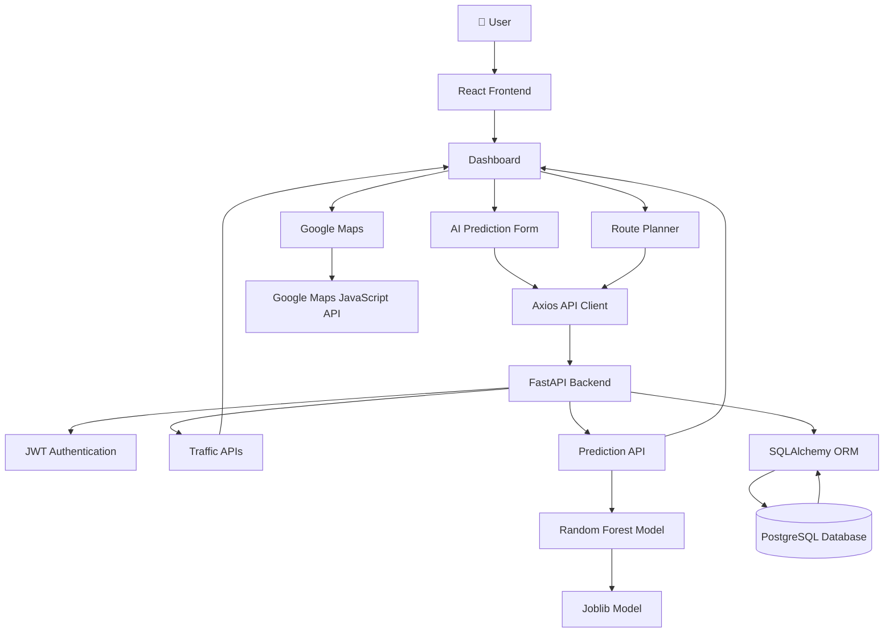

# 🚦 TrafficVision AI

### Smart Traffic Monitoring & Congestion Management System

_A full-stack web application for real-time traffic monitoring, secure user authentication, and intelligent traffic management, built using React, FastAPI, and PostgreSQL._

## 📖 Project Description

TrafficVision AI is a full-stack Smart Traffic Monitoring and Congestion Management System designed to improve urban transportation through Artificial Intelligence, Machine Learning, and real-time traffic analytics.

The project is being developed as part of the Infosys Springboard Internship to simulate a modern Intelligent Transportation System (ITS) capable of monitoring traffic conditions, predicting congestion, recommending optimal travel routes, and assisting commuters and traffic authorities with data-driven decision making.

The system follows a scalable client-server architecture consisting of:

- React + Vite frontend
- FastAPI backend
- PostgreSQL database
- Machine Learning prediction service
- Google Maps Platform integration

Currently, the application provides secure JWT-based authentication, Role-Based Access Control (RBAC), live traffic monitoring, an AI-powered congestion prediction module using a trained Random Forest Regression model, an interactive Google Maps traffic visualization, and an AI Route Recommendation system.

The machine learning pipeline includes dataset preprocessing, feature engineering, model comparison, hyperparameter tuning, model serialization using Joblib, and deployment through FastAPI REST APIs.

The project continues to evolve with upcoming features including intelligent route optimization, real-time traffic alerts, analytics dashboards, cloud deployment, and large-scale multi-city traffic monitoring.

## 🚧 Project Status

**Completed Milestone:** Week 1 & 2 – Project Initialization, Design Process & Core Setup

**Completed Milestone:** Week 3 & 4 – Traffic Prediction & Route Optimization

---

### ✅ Completed

#### Core System

- Project architecture and folder structure
- Backend setup using FastAPI
- Frontend setup using React (Vite)
- PostgreSQL database integration
- SQLAlchemy ORM configuration
- JWT Authentication
- Role-Based Access Control (RBAC)
- User Registration & Login
- Protected API endpoints
- Frontend–Backend–Database connectivity

#### Dashboard

- Live Traffic Monitoring Dashboard
- Traffic Summary Cards
- Traffic Trend Chart
- Live Traffic Data Table
- Dashboard Layout
- Dashboard Components
- Dashboard Refactoring
- Role-specific dashboards
- Public Navigation Bar
- Improved Login UI
- Improved Register UI

#### Machine Learning

- Dataset Selection
- Data Quality Assessment
- Missing Value Analysis
- Duplicate Analysis
- Exploratory Data Analysis (EDA)
- Feature Engineering
- Data Preprocessing Pipeline
- Decision Tree Model
- Random Forest Model
- Extra Trees Model
- Gradient Boosting Model
- Model Performance Comparison
- Hyperparameter Tuning
- Final Random Forest Model
- Model Serialization using Joblib

#### Artificial Intelligence

- FastAPI Prediction API
- Swagger Prediction Endpoint Testing
- AI Congestion Prediction Dashboard
- Interactive Prediction Form
- AI Prediction Cards
- AI Recommendation Panel

#### Google Maps Integration

- Google Maps JavaScript API
- Interactive Traffic Heat Map
- Dynamic Traffic Markers
- Color-coded Congestion Indicators
- Traffic Statistics Cards
- AI Route Planner
- AI Route Recommendation Engine
- 10 Bangalore Traffic Locations
- Dynamic Location Selection
- Intelligent Route Recommendation

#### Development

- Git Version Control
- GitHub Repository
- Modular Folder Structure
- README Documentation

---

### 🚧 Currently In Progress

- Multi-city Traffic Dataset Expansion
- Dashboard UI Enhancement
- Responsive Design Improvements

---

### 📅 Upcoming Milestones

- Multi-State Traffic Coverage
- Historical Traffic Analytics
- Interactive Reports
- Real-Time Notifications
- Admin Analytics Dashboard
- Docker Deployment
- Cloud Deployment
- CI/CD Pipeline

## 🎯 Project Objectives

The primary objectives of TrafficVision AI are:

- Develop a scalable full-stack Smart Traffic Management System.
- Monitor traffic conditions in real time through an interactive dashboard.
- Implement secure user authentication using JWT.
- Enforce Role-Based Access Control (RBAC) for different user roles.
- Build a modular and maintainable backend using FastAPI and SQLAlchemy.
- Integrate a PostgreSQL database for reliable data storage and retrieval.
- Establish seamless communication between the frontend, backend, and database.
- Provide a foundation for future AI-based traffic prediction and route optimization.
- Follow industry-standard software development practices, including Git version control, documentation, and modular project architecture.

## ✨ Features

### ✅ Current Features

### 🔐 Authentication

- JWT Authentication
- OAuth2 Password Flow
- Role-Based Access Control (RBAC)
- User Registration
- User Login
- Protected Routes
- User Profile
- Secure Logout

### 🛠 Backend

- FastAPI REST API
- PostgreSQL database integration
- SQLAlchemy ORM
- Pydantic Validation
- Environment variable configuration using `.env`
- Modular project architecture
- Protected API endpoints

### 💻 Frontend

- React + Vite application
- React Router navigation
- Axios API integration
- Responsive Dashboard Layout
- Modern Home Page
- Modern Login Page
- Modern Register Page
- Dashboard Components

### 🚦 Traffic Dashboard

- Live Traffic Monitoring
- Traffic Summary Cards
- Traffic Trend Chart
- Live Traffic Data Table
- Dashboard Layout
- Dashboard Header
- Dashboard Cards
- Dashboard Content
- Role-specific Dashboards

### 🤖 Artificial Intelligence

- Random Forest Congestion Prediction
- Machine Learning Prediction API
- AI Congestion Prediction Dashboard
- Interactive Prediction Form
- Live Prediction Results
- AI Recommendation Panel
- Prediction Confidence Score

### 🗺️ Google Maps

- Interactive Google Map
- Color-coded Traffic Markers
- Live Congestion Visualization
- AI Route Planner
- Origin & Destination Selection
- Intelligent Route Recommendation
- Traffic Heat Map
- Traffic Statistics Cards
- 10 Smart Traffic Locations

### 🧠 Machine Learning

- Dataset Cleaning
- Data Quality Assessment
- Feature Engineering
- Data Preprocessing
- Model Training
- Model Comparison
- Hyperparameter Tuning
- Random Forest Model
- FastAPI Prediction API
- Joblib Model Deployment

### ⚙ Development

- Git Version Control
- GitHub Repository
- Modular Folder Structure
- Swagger Documentation
- README Documentation

---

### 🚀 Planned Features

- Real-Time Traffic Alerts
- Docker Containerization
- Cloud Deployment
- CI/CD Pipeline

## 🛠️ Technology Stack

| Category              | Technologies                                |
| --------------------- | ------------------------------------------- |
| **Frontend**          | React, Vite, React Router, Axios            |
| **Backend**           | FastAPI, SQLAlchemy, Pydantic               |
| **Database**          | PostgreSQL                                  |
| **Authentication**    | JWT, OAuth2 Password Flow, Passlib (bcrypt) |
| **Development Tools** | Git, GitHub, VS Code, pgAdmin               |
| **Configuration**     | Python Virtual Environment, python-dotenv   |

## 📊 Machine Learning Workflow

TrafficVision AI follows a complete end-to-end Machine Learning pipeline for intelligent traffic congestion prediction and AI-assisted route recommendation.

1. Dataset Collection
2. Data Quality Assessment
3. Exploratory Data Analysis (EDA)
4. Missing Value Handling
5. Duplicate Data Removal
6. Feature Engineering
7. Data Preprocessing
8. Model Training
9. Model Comparison
10. Hyperparameter Tuning
11. Final Random Forest Model Selection
12. Model Serialization using Joblib
13. FastAPI Prediction API Development
14. Swagger API Testing
15. React Prediction Dashboard Integration
16. Google Maps Integration
17. AI Traffic Heat Map
18. Color-coded Congestion Visualization
19. AI Route Planner
20. AI Route Recommendation Engine
21. Travel Time Estimation
22. Delay Prediction
23. AI Confidence & Route Quality Analysis
24. Multi-location Traffic Prediction

## 🏗️ System Architecture



## 📁 Project Structure

```text
trafficvision-ai-smart-traffic-prediction/
│
├── analysis/
│   ├── datasets/
│   │   ├── raw/
│   │   │   └── Banglore_traffic_Dataset.csv          # Original traffic dataset
│   │   └── processed/
│   │       └── traffic_processed.csv                 # Cleaned & preprocessed dataset
│   │
│   ├── models/
│   │   └── best_model.pkl                            # Trained Random Forest model
│   │
│   ├── notebooks/
│   │   ├── 00_environment_setup.ipynb                # Environment setup
│   │   ├── 01_dataset_evaluator.ipynb                # Dataset quality assessment
│   │   ├── 02_eda.ipynb                              # Exploratory Data Analysis
│   │   ├── 03_feature_engineering.ipynb              # Feature engineering
│   │   ├── 04_preprocessing.ipynb                    # Data preprocessing
│   │   ├── 05_model_training.ipynb                   # ML model training
│   │   ├── 06_model_comparison.ipynb                 # Compare ML models
│   │   └── 07_hyperparameter_tuning.ipynb            # Hyperparameter tuning
│   │
│   └── src/
│       ├── eda.py                                    # EDA helper functions
│       ├── feature_engineering.py                    # Feature engineering pipeline
│       ├── preprocessing.py                          # Data preprocessing utilities
│       └── quality.py                                # Dataset quality analysis
│
├── backend/
│   ├── app/
│   │   ├── config/
│   │   │   └── auth.py                               # JWT authentication configuration
│   │   │
│   │   ├── constants/
│   │   │   └── roles.py                              # User role definitions
│   │   │
│   │   ├── database/
│   │   │   ├── base.py                               # SQLAlchemy base model
│   │   │   └── connection.py                         # PostgreSQL database connection
│   │   │
│   │   ├── dependencies/
│   │   │   └── auth.py                               # Authentication dependencies
│   │   │
│   │   ├── ml/
│   │   │   ├── best_model.pkl                        # Deployed ML model
│   │   │   └── predictor.py                          # Prediction engine
│   │   │
│   │   ├── models/
│   │   │   ├── traffic.py                            # Traffic database model
│   │   │   └── user.py                               # User database model
│   │   │
│   │   ├── routers/
│   │   │   ├── prediction.py                         # Prediction API routes
│   │   │   ├── traffic.py                            # Traffic API routes
│   │   │   └── user.py                               # User & authentication routes
│   │   │
│   │   ├── schemas/
│   │   │   ├── prediction.py                         # Prediction request/response schemas
│   │   │   ├── traffic.py                            # Traffic schemas
│   │   │   └── user.py                               # User schemas
│   │   │
│   │   ├── utils/
│   │   │   └── security.py                           # Password hashing & JWT utilities
│   │   │
│   │   └── main.py                                   # FastAPI application entry point
│   │
│   ├── requirements.txt                              # Backend dependencies
│   ├── .env                                          # Backend environment variables
│   └── .env.example                                  # Sample environment configuration
│
├── frontend/
│   ├── public/                                       # Static public assets
│   │
│   ├── src/
│   │   ├── assets/                                   # Images & static resources
│   │   │
│   │   ├── components/
│   │   │   ├── FeaturesSection.jsx                   # Homepage features section
│   │   │   ├── HeroSection.jsx                       # Homepage hero banner
│   │   │   ├── HowItWorksSection.jsx                 # Workflow explanation section
│   │   │   ├── Navbar.jsx                            # Dashboard navigation bar
│   │   │   ├── ProtectedRoute.jsx                    # Authentication protection
│   │   │   ├── PublicNavbar.jsx                      # Public website navbar
│   │   │   ├── RoleProtectedRoute.jsx                # Role-based route protection
│   │   │   ├── Sidebar.jsx                           # Dashboard sidebar
│   │   │   ├── TrafficCard.jsx                       # Traffic summary card
│   │   │   ├── TrafficChart.jsx                      # Traffic trend chart
│   │   │   ├── TrafficTable.jsx                      # Live traffic table
│   │   │   │
│   │   │   └── dashboard/
│   │   │       ├── DashboardCards.jsx                # Dashboard statistics cards
│   │   │       ├── DashboardContent.jsx              # Dashboard content section
│   │   │       ├── DashboardHeader.jsx               # Dashboard header
│   │   │       ├── DashboardLayout.jsx               # Dashboard layout wrapper
│   │   │       ├── PredictionPanel.jsx               # AI congestion prediction form
│   │   │       ├── TrafficMap.jsx                    # Interactive Google Maps traffic visualization
│   │   │       ├── RoutePlanner.jsx                  # Route planning interface
│   │   │       └── RouteRecommendation.jsx           # AI route recommendation engine
│   │   │
│   │   ├── pages/
│   │   │   ├── Home.jsx                              # Landing page
│   │   │   ├── Login.jsx                             # User login page
│   │   │   ├── Register.jsx                          # User registration page
│   │   │   ├── admin/
│   │   │   │   └── Dashboard.jsx                     # Admin dashboard
│   │   │   ├── operator/
│   │   │   │   ├── Dashboard.jsx                     # Traffic operator dashboard
│   │   │   │   └── Prediction.jsx                    # AI prediction page
│   │   │   └── commuter/
│   │   │       └── Dashboard.jsx                     # Commuter dashboard
│   │   │
│   │   ├── services/
│   │   │   ├── api.js                                # Axios configuration
│   │   │   ├── auth.js                               # Authentication APIs
│   │   │   ├── prediction.js                         # Prediction API service
│   │   │   ├── mapPrediction.js                      # Google Maps prediction service
│   │   │   ├── traffic.js                            # Traffic APIs
│   │   │   └── user.js                               # User APIs
│   │   │
│   │   ├── styles/
│   │   │   ├── chart.css                             # Chart styling
│   │   │   ├── global.css                            # Global application styles
│   │   │   ├── HeroSection.css                       # Hero section styling
│   │   │   ├── Home.css                              # Homepage styling
│   │   │   ├── HowItWorks.css                        # Workflow section styling
│   │   │   ├── Login.css                             # Login page styling
│   │   │   ├── map.css                               # Google Maps styling
│   │   │   ├── prediction.css                        # Prediction & Route Planner styling
│   │   │   ├── Register.css                          # Registration page styling
│   │   │   ├── trafficcard.css                       # Traffic cards styling
│   │   │   └── traffictable.css                      # Traffic table styling
│   │   │
│   │   ├── App.jsx                                   # Root React component
│   │   └── main.jsx                                  # React application entry point
│   │
│   ├── .env                                          # Frontend environment variables
│   ├── .gitignore                                    # Git ignore rules
│   ├── eslint.config.js                              # ESLint configuration
│   ├── index.html                                    # HTML entry page
│   ├── package-lock.json                             # Locked dependency versions
│   ├── package.json                                  # Frontend dependencies
│   ├── README.md                                     # Frontend documentation
│   └── vite.config.js                                # Vite configuration
│
├── .gitignore                                        # Repository ignore rules
├── LICENSE                                           # MIT License
├── project_structure.txt                             # Project directory snapshot
└── README.md                                         # Main project documentation
```

## 🚀 Getting Started

### 📋 Prerequisites

Before running the project, ensure the following software is installed on your system:

| Software           | Recommended Version |
| ------------------ | ------------------- |
| Python             | 3.12 or later       |
| Node.js            | 20.x LTS or later   |
| PostgreSQL         | 16 or later         |
| Git                | Latest Version      |
| Visual Studio Code | Latest Version      |

### Recommended VS Code Extensions

- Python
- Pylance
- ESLint
- Prettier
- PostgreSQL (optional)

### ⚙️ Backend Setup

1. Clone the repository:

```bash
git clone https://github.com/springboardmentor620-ai/trafficvision-ai-smart-traffic-prediction.git

cd TrafficVision-AI
```

2. Navigate to the backend directory:

```bash
cd backend
```

3. Create a Python virtual environment:

```bash
python -m venv venv
```

4. Activate the virtual environment:

**Windows (PowerShell):**

```powershell
venv\Scripts\Activate.ps1
```

**Windows (Command Prompt):**

```cmd
venv\Scripts\activate
```

**Linux/macOS:**

```bash
source venv/bin/activate
```

5. Install the required dependencies:

```bash
pip install -r requirements.txt
```

### 🗄️ Database Setup

1. Start the PostgreSQL server.

2. Create a new database:

```sql
CREATE DATABASE trafficvision_db;
```

3. Verify that the database has been created successfully using pgAdmin or the PostgreSQL command line.

4. Configure the database connection in the `.env` file (explained in the next section).

5. The required tables will be created automatically when the FastAPI application starts for the first time.

````

### 💻 Frontend Setup

1. Open a new terminal.

2. Navigate to the frontend directory:

```bash
cd frontend
````

3. Install all required dependencies:

```bash
npm install
```

4. Start the React development server:

```bash
npm run dev
```

5. Open your browser and visit:

```text
http://localhost:5173
```

The frontend will automatically connect to the FastAPI backend if both applications are running.

### 🔐 Environment Variables

Create a `.env` file inside the `backend` directory and configure the following variables:

```env
DATABASE_URL=postgresql://<username>:<password>@localhost:5432/trafficvision_db

SECRET_KEY=your_secret_key_here

ALGORITHM=HS256

ACCESS_TOKEN_EXPIRE_MINUTES=30
```

> **Note:** Never commit your `.env` file to GitHub. Ensure it is included in `.gitignore` to keep sensitive information secure.

### ▶️ Running the Application

To run the complete application, start the backend and frontend in separate terminals.

### Start the Backend

```bash
cd backend

python -m uvicorn app.main:app --reload
```

The backend will be available at:

```text
http://localhost:8000
```

### Start the Frontend

```bash
cd frontend

npm run dev
```

The frontend will be available at:

```text
http://localhost:5173
```

Once both services are running, open your browser and visit:

```text
http://localhost:5173
```

to access the TrafficVision AI application.

### 📖 API Documentation

FastAPI automatically generates interactive API documentation.

After starting the backend, the documentation can be accessed at:

### Swagger UI

```text
http://localhost:8000/docs
```

### ReDoc

```text
http://localhost:8000/redoc
```

These interfaces allow you to:

- View all available API endpoints.
- Test APIs directly from the browser.
- Inspect request and response schemas.
- Verify authentication and authorization workflows.

## 🌐 API Overview

### 🔐 Authentication APIs

| Method | Endpoint    | Access | Description                                         |
| ------ | ----------- | ------ | --------------------------------------------------- |
| POST   | `/register` | Public | Register a new user                                 |
| POST   | `/login`    | Public | Authenticate a user and generate a JWT access token |

---

### 👤 User APIs

| Method | Endpoint | Access        | Description                                     |
| ------ | -------- | ------------- | ----------------------------------------------- |
| GET    | `/me`    | Authenticated | Retrieve the currently logged-in user's profile |
| GET    | `/users` | Admin Only    | Retrieve the list of all registered users       |

---

### 🤖 Prediction API

| Method | Endpoint              | Access        | Description                                                      |
| ------ | --------------------- | ------------- | ---------------------------------------------------------------- |
| POST   | `/prediction/predict` | Authenticated | Predict traffic congestion using the trained Random Forest model |

## 📅 Development Progress

The development of **TrafficVision AI** has been carried out in multiple phases, with each phase focusing on a major aspect of the system before progressing to the next.

---

### 🚀 Phase 1: Project Initialization

**Completed**

- Selected the project technology stack.
- Created the GitHub repository.
- Designed overall project architecture.
- Configured the development environment.
- Installed Python, PostgreSQL, pgAdmin, Node.js, and Git.
- Created frontend and backend folder structure.
- Created the Python virtual environment.
- Installed backend and frontend dependencies.

---

### 🗄️ Phase 2: Backend & Database Development

**Completed**

- Developed the FastAPI backend.
- Connected FastAPI with PostgreSQL.
- Configured SQLAlchemy ORM.
- Created database models.
- Configured database connectivity.
- Implemented automatic database table creation.
- REST API development.
- Tested backend APIs.

---

### 🔐 Phase 3: Authentication & Authorization

**Completed**

- User Registration
- User Login
- Password Hashing (bcrypt)
- JWT Authentication
- OAuth2 Password Flow
- Role-Based Access Control (RBAC)
- Protected API Endpoints
- Token Validation
- Logout Functionality

---

### 💻 Phase 4: Frontend Development

**Completed**

- Created the React application using Vite.
- Configured React Router.
- Integrated Axios for API communication.
- Implemented Protected Routes.
- Role Protected Routes.
- Public Navigation Bar.
- Dashboard Navigation.
- Responsive Login & Registration Pages.
- Connected the frontend with backend APIs.
- Stored JWT tokens securely in Local Storage.

---

### 📊 Phase 5: Dashboard Development

**Completed**

- Designed the initial dashboard layout.
- Integrated live traffic APIs.
- Added traffic summary cards.
- Added traffic trend visualization.
- Added live traffic data table.
- Dashboard Layout.
- Dashboard Header.
- Dashboard Refactoring.
- Displayed authenticated user information.
- Role-specific Dashboards.

---

### 🤖 Phase 6: AI & Machine Learning

**Completed**

- Dataset Evaluation.
- Data Quality Assessment.
- Exploratory Data Analysis (EDA).
- Data Cleaning.
- Feature Engineering.
- Data Preprocessing Pipeline.
- Random Forest Model.
- Decision Tree Model.
- Extra Trees Model.
- Gradient Boosting Model.
- Model Comparison.
- Hyperparameter Tuning.
- Best Model Selection.
- Model Serialization using Joblib.
- FastAPI Prediction API.
- Swagger API Testing.

---

### 🗺️ Phase 7: Traffic Visualization & Route Recommendation

**Completed**

- Google Maps Integration.
- AI Congestion Prediction Panel.
- Interactive Traffic Heat Map.
- Color-coded Traffic Markers.
- Live Traffic Information Windows.
- Multiple Bangalore Traffic Zones.
- Route Planner.
- AI Route Recommendation.
- Traffic Congestion Visualization.
- Frontend Prediction Integration.

---

### 🚧 Phase 8: Upcoming Features

**Planned**

- Route Optimization Engine
- Live Traffic Streaming
- Analytics Dashboard
- Historical Reports
- Notifications
- Docker Deployment
- Cloud Deployment

## 🛠️ Problems Faced & Solutions

During the development of TrafficVision AI, several technical challenges were encountered and resolved. Documenting these issues helps future contributors understand the development process and provides troubleshooting guidance.

| Problem                                                | Solution                                                                                                 |
| ------------------------------------------------------ | -------------------------------------------------------------------------------------------------------- |
| Python environment setup and PATH configuration        | Installed Python correctly, configured the virtual environment, and verified the Python installation.    |
| PostgreSQL connection issues                           | Configured PostgreSQL correctly and verified the database connection before integrating it with FastAPI. |
| SQLAlchemy database configuration                      | Organized the database layer into a dedicated module and configured session management.                  |
| Missing database driver (`psycopg`)                    | Installed the required PostgreSQL driver and updated the database connection string.                     |
| Environment variable management                        | Moved sensitive configuration values to a `.env` file using `python-dotenv`.                             |
| CORS errors between React and FastAPI                  | Configured FastAPI CORS middleware to allow frontend requests during development.                        |
| OAuth2 authentication (422 Validation Error)           | Updated the frontend login request to use the correct `OAuth2PasswordRequestForm` format.                |
| JWT authentication issues                              | Implemented secure token generation, validation, and protected API endpoints.                            |
| Frontend–Backend communication                         | Configured Axios with a reusable API service and verified backend connectivity.                          |
| Dashboard data integration                             | Replaced static frontend data with live data retrieved from backend APIs.                                |
| Large dashboard component became difficult to maintain | Refactored the dashboard into reusable React components following component-based architecture.          |
| Machine learning model accuracy                        | Compared multiple ML models and selected Random Forest after hyperparameter tuning.                      |
| Feature engineering complexity                         | Created a reusable preprocessing pipeline.                                                               |
| Integrating ML model with FastAPI                      | Serialized model using Joblib and created prediction endpoint.                                           |
| Google Maps integration                                | Configured Maps API and rendered interactive traffic markers.                                            |
| Dynamic traffic visualization                          | Implemented color-coded congestion markers and info windows.                                             |
| Route recommendation logic                             | Built AI-based route planner using congestion predictions.                                               |
| Responsive dashboard layout                            | Improved UI using reusable CSS and flexible layouts.                                                     |

## 🧪 Testing

The following components have been tested during development to ensure the application functions as expected.

| Component                    | Status    | Testing Method                                                                                       |
| ---------------------------- | --------- | ---------------------------------------------------------------------------------------------------- |
| Backend API                  | ✅ Passed | Tested using FastAPI Swagger UI (`/docs`)                                                            |
| Database Connection          | ✅ Passed | Verified PostgreSQL connectivity and CRUD operations                                                 |
| User Registration            | ✅ Passed | Successfully created new user accounts                                                               |
| User Login                   | ✅ Passed | JWT token generated after successful authentication                                                  |
| Protected APIs               | ✅ Passed | Verified access using JWT authentication                                                             |
| Role-Based Access Control    | ✅ Passed | Tested Admin and User authorization                                                                  |
| Frontend–Backend Integration | ✅ Passed | Verified Axios communication with FastAPI                                                            |
| Dashboard                    | ✅ Passed | Successfully displayed live traffic data from PostgreSQL                                             |
| Authentication Flow          | ✅ Passed | Verified login, token storage, protected routes, and logout functionality                            |
| Role-Based Dashboards        | ✅ Passed | Verified navigation and access for Admin, Traffic Operator, and Commuter                             |
| AI Prediction API            | ✅ Passed | Successfully predicted low, medium and high congestion levels using the deployed Random Forest model |
| ML Model Integration         | ✅ Passed | Joblib Model Inference                                                                               |
| Google Maps Integration      | ✅ Passed | Interactive Map Rendering                                                                            |
| Traffic Heat Map             | ✅ Passed | Dynamic Congestion Markers                                                                           |
| Route Planner                | ✅ Passed | Origin–Destination Selection                                                                         |
| AI Route Recommendation      | ✅ Passed | Predicted Route Analysis                                                                             |
| Traffic Information Windows  | ✅ Passed | Marker Popup Testing                                                                                 |

## 🗺️ Roadmap

The following enhancements are planned for future phases of TrafficVision AI:

### 🎨 User Interface

- Improved Navigation & Sidebar
- Dark Mode Support
- Mobile Responsive Design
- Better Dashboard UI
- Accessibility Improvements

### 🚦 Traffic Management

- Incident Reporting
- Traffic History
- Real-time Traffic Streaming
- Live Sensor Integration
- Traffic Alerts
- Zone Management

### 🤖 Artificial Intelligence

- Real-time Congestion Prediction
- Smart Route Optimization
- Traffic Pattern Analysis
- Predictive Analytics
- Travel Time Prediction
- Traffic Forecasting
- Adaptive Route Recommendation

### 📊 Analytics & Reporting

- Interactive Charts
- Historical Traffic Analysis
- Downloadable Reports
- Performance Dashboard
- AI Insights

### ☁️ Deployment & DevOps

- Docker Containerization
- Cloud Deployment
- CI/CD Pipeline
- Environment-based Configuration
- Production Monitoring

### 🔒 Security & Performance

- Refresh Tokens
- Rate Limiting
- API Monitoring
- Database Performance Tuning

## 📄 License

This project is licensed under the **MIT License**.

You are free to use, modify, and distribute this project in accordance with the terms of the license.

For more information, see the [LICENSE](LICENSE) file.

## 🙏 Acknowledgements

This project has been developed as part of an internship to gain practical experience in full-stack web development and modern software engineering practices.

Special thanks to:

- The internship mentors for providing project guidance and requirements.
- The open-source community for maintaining the tools and frameworks used in this project.
- The developers and maintainers of FastAPI, React, PostgreSQL, SQLAlchemy, Vite, and other open-source libraries that made this project possible.
- OpenAI ChatGPT for technical guidance, debugging assistance, architecture discussions, and documentation support throughout the development process.
