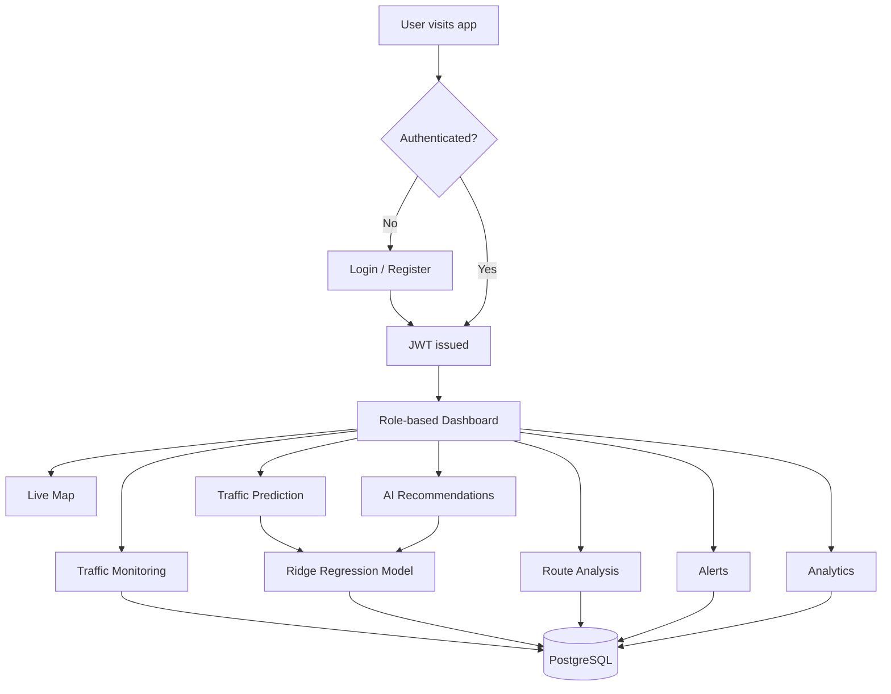
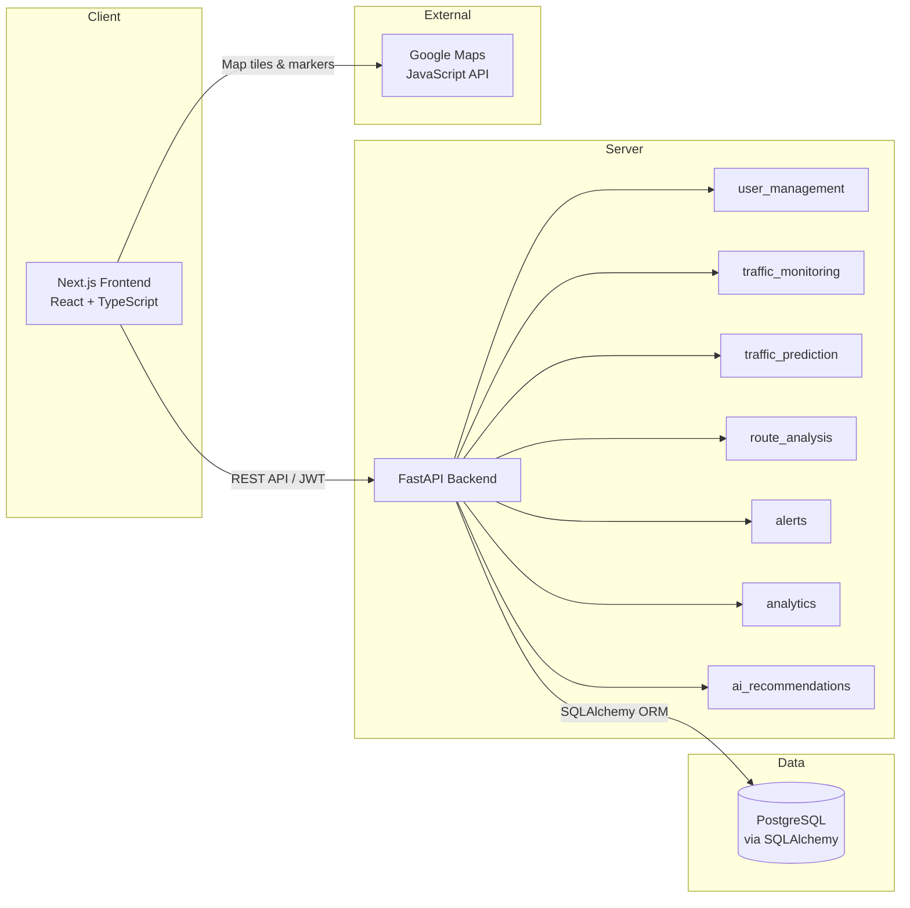

# 🚦 TrafficVision AI — Smart Traffic Management Platform

**AI-assisted traffic monitoring, congestion prediction, and route analysis — built as a full-stack web application with a FastAPI backend and a Next.js frontend.**

---

## 📑 Table of Contents

1. [Project Overview](#-project-overview)
2. [Problem Statement](#-problem-statement)
3. [Objectives](#-objectives)
4. [Key Features](#-key-features)
5. [System Modules](#-system-modules)
6. [How the System Works](#-how-the-system-works)
7. [Application Workflow](#-application-workflow)
8. [Technology Stack](#-technology-stack)
9. [Project Architecture](#-project-architecture)
10. [Frontend Details](#-frontend-details)
11. [Backend Details](#-backend-details)
12. [Database Details](#-database-details)
13. [Traffic Prediction](#-traffic-prediction)
14. [Traffic Monitoring](#-traffic-monitoring)
15. [Traffic Analytics](#-traffic-analytics)
16. [Traffic Alerts](#-traffic-alerts)
17. [Route Optimization / Road Management](#-route-optimization--road-management)
18. [User Authentication and Role-Based Access Control](#-user-authentication-and-role-based-access-control)
19. [Project Structure](#-project-structure)
20. [Prerequisites](#-prerequisites)
21. [Installation and Setup](#-installation-and-setup)
22. [Environment Variables](#-environment-variables)
23. [Running the Application](#-running-the-application)
24. [API Overview](#-api-overview)
25. [Database Schema / Data Flow](#-database-schema--data-flow)
26. [Dataset](#-dataset)
27. [Screens / Dashboard](#-screens--dashboard)
28. [Testing and Validation](#-testing-and-validation)
29. [Deployment](#-deployment)
30. [Security Considerations](#-security-considerations)
31. [Known Limitations](#-known-limitations)
32. [Future Enhancements](#-future-enhancements)
33. [Learning Outcomes](#-learning-outcomes)
34. [Internship Context](#-internship-context)
35. [Project Demonstration](#-project-demonstration)
36. [Contributors](#-contributors)
37. [Acknowledgements](#-acknowledgements)
38. [License](#-license)
39. [Contact](#-contact)

---

## 🧭 Project Overview

**TrafficVision AI** is a smart traffic management platform that helps city authorities monitor traffic conditions, forecast congestion, analyze traffic patterns, and receive alerts — all through a centralized, role-based web dashboard.

The platform is built as a full-stack application:
- **Backend:** FastAPI (Python) serving a modular REST API
- **Frontend:** Next.js (React + TypeScript) dashboard application
- **Database:** PostgreSQL, accessed through SQLAlchemy ORM
- **Prediction:** A per-road Ridge Regression model (scikit-learn) trained on historical readings

As of this documentation, the project has completed **Milestones 1–3** of its development plan — core setup and authentication, prediction and route analysis, and alerts/analytics/AI recommendations. **Milestone 4** (testing, deployment, and final documentation) is in progress.

---

## ❓ Problem Statement

Urban traffic congestion is difficult for city authorities to manage without a centralized view of road conditions. Traffic data is often scattered, there is little advance warning before congestion worsens, and manual monitoring makes it hard to compare routes or prioritize response to incidents. TrafficVision AI addresses this by bringing traffic monitoring, forecasting, alerting, and analytics into a single platform.

---

## 🎯 Objectives

- Provide a centralized dashboard for monitoring live traffic conditions across multiple roads
- Forecast near-term congestion using historical traffic readings
- Help compare routes using estimated travel time under current/predicted conditions
- Alert administrators and operators to severe congestion, accidents, closures, and emergencies
- Provide analytics (utilization, trends, zone-level heatmaps) to support traffic planning
- Enforce role-based access so that admins, traffic operators, and the public see appropriate views

---

## ✨ Key Features

> Features below reflect what is **implemented** in the current codebase, organized by development milestone.

| Feature | Status |
|---|---|
| JWT-based authentication (register/login) | ✅ Implemented |
| Role-based access control (Admin / Traffic Operator / Public) | ✅ Implemented |
| Admin user management (list/deactivate users) | ✅ Implemented (frontend page) |
| Road CRUD (create, list, update, delete) | ✅ Implemented |
| Traffic reading submission (manual + simulate endpoint) | ✅ Implemented |
| Live traffic dashboard & road utilization view | ✅ Implemented |
| Google Maps live map with congestion-coded pins | ✅ Implemented |
| Per-road congestion forecasting (Ridge Regression) | ✅ Implemented |
| Prediction report (current vs. predicted, trend indicator) | ✅ Implemented |
| Route comparison (direct vs. alternate) with travel-time estimation | ✅ Implemented |
| Congestion / accident / closure / emergency alerts | ✅ Implemented |
| Alert resolve/delete workflow | ✅ Implemented |
| Analytics dashboard (summary cards, day-over-day comparison) | ✅ Implemented |
| Zone-level congestion heatmap | ✅ Implemented |
| Road performance ranking table | ✅ Implemented |
| Forecast-driven AI recommendations per road | ✅ Implemented |

---

## 🧩 System Modules

The backend is organized into the following modules (`backend/app/modules/`):

| Module | Responsibility |
|---|---|
| `user_management` | Authentication, RBAC, user profiles |
| `traffic_monitoring` | Roads, traffic readings, live status, utilization |
| `traffic_prediction` | ML-based forecasting and prediction reports |
| `route_analysis` | Route comparison and travel-time estimation |
| `alerts` | Congestion / accident / closure / emergency alerts |
| `analytics` | Dashboard summary, heatmap, performance ranking |
| `ai_recommendations` | Forecast-driven, per-road recommendations |

---

## ⚙️ How the System Works

1. **Data ingestion** — Traffic readings are added per road either manually (by an admin/operator) or via a `simulate` endpoint that generates new readings. There is currently **no live sensor/camera/IoT integration** — readings are manually submitted or simulated, not pulled from real-time external sensors.
2. **Monitoring** — The latest readings per road drive the live dashboard, the utilization view, and the color-coded Google Maps pins.
3. **Prediction** — When a forecast is requested, a Ridge Regression model is trained on that road's historical readings (using cyclically-encoded time-of-day/day-of-week features plus a trend term) and produces a forecast for a requested number of hours ahead.
4. **Route analysis** — Given an origin and destination road, the system compares a direct route against alternates via other monitored roads, estimating travel time from haversine (straight-line) distance and congestion-based speed estimates.
5. **Alerts** — Severe congestion automatically raises an alert (with duplicate-prevention), and admins/operators can manually report accidents, closures, or emergencies.
6. **Analytics** — Aggregated views (dashboard summary cards, zone heatmap, performance table) are computed from stored readings, including day-over-day comparisons where historical data supports it.
7. **AI Recommendations** — For each road, a fresh forecast is combined with current status to produce a priority level and a plain-English recommendation.

---

## 🔄 Application Workflow



---

## 🛠 Technology Stack

| Layer | Technology |
|---|---|
| **Backend** | Python, FastAPI |
| **Frontend** | Next.js (React), TypeScript, Tailwind CSS |
| **Database** | PostgreSQL, accessed via SQLAlchemy ORM |
| **Authentication** | JWT (OAuth2 password flow), bcrypt password hashing |
| **Machine Learning** | scikit-learn (Ridge Regression), pandas, numpy |
| **Maps** | Google Maps JavaScript API |
| **UI Icons** | lucide-react |
| **Version Control** | Git, GitHub |

---

## 🏗 Project Architecture



**Flow summary:** The Next.js frontend communicates with the FastAPI backend over a REST API secured with JWT bearer tokens. The backend's modules each own a slice of the domain (users, roads/readings, prediction, routes, alerts, analytics, recommendations) and persist data through SQLAlchemy to PostgreSQL. The frontend additionally calls the Google Maps JavaScript API directly from the browser to render the live map.

---

## 🖥 Frontend Details

Built with **Next.js (App Router)**, **React**, and **TypeScript**, styled with **Tailwind CSS**.

Key frontend areas:
- `app/login/`, `app/register/` — authentication pages
- `app/dashboard/page.tsx` — overview dashboard
- `app/dashboard/monitoring/` — traffic monitoring views
- `app/dashboard/prediction/` — traffic prediction reports
- `app/dashboard/live-map/` — Google Maps live view
- `app/dashboard/routes/` — route analysis / comparison
- `app/dashboard/alerts/` — alert feed and incident reporting
- `app/dashboard/analytics/` — summary cards, heatmap, performance table
- `app/dashboard/ai-recommendations/` — AI recommendation cards
- `app/dashboard/users/` — admin user management (list/deactivate)
- `components/` — shared UI (Sidebar, Topbar, DashboardShell)
- `lib/` — API client and authentication context

---

## 🔧 Backend Details

Built with **FastAPI**, organized as a modular application under `backend/app/`:

- `main.py` — application entry point
- `config.py` — configuration/settings
- `database.py` — database connection/session setup
- `modules/` — one folder per domain module (see [System Modules](#-system-modules))

Interactive API documentation is auto-generated by FastAPI and available at `/docs` (Swagger UI) when the backend is running.

---

## 🗄 Database Details

- **Engine:** PostgreSQL
- **ORM:** SQLAlchemy
- **Confirmed core entities:** `Users`, `Roles`, `Roads`, `TrafficReadings`

The system also persists alert records to support the alerts API (create, list, resolve, delete), though the exact table/model name for alerts is not detailed in the available project documentation and should be confirmed directly against the backend models before being documented further.

> 📌 **Note:** This section reflects the schema as described in prior project documentation. For a fully authoritative schema (columns, relationships, constraints), refer to the SQLAlchemy model files under `backend/app/modules/*/models.py` (or equivalent) in the codebase.

---

## 🔮 Traffic Prediction

TrafficVision AI's prediction feature is a **statistical machine learning model**, not a deep-learning or computer-vision system:

- **Algorithm:** Ridge Regression (scikit-learn), trained **per road** on that road's historical readings
- **Features:** Cyclically-encoded time-of-day and day-of-week, plus a trend term
- **Output:** Forecasted vehicle count and congestion level for a requested number of hours ahead
- **Safeguards:** A minimum-data-points requirement before a road can be forecast, and a bounded prediction range to avoid unrealistic extrapolation

Prediction accuracy depends on how much historical data exists for a given road — roads with fewer stored readings will produce less reliable forecasts. This is **not presented as a highly accurate or production-grade forecasting system**; it is an internship-scope implementation of a regression-based prediction workflow.

---

## 🚦 Traffic Monitoring

- Roads are registered and managed via CRUD endpoints
- Traffic readings (vehicle count, speed, etc.) are added manually or through a `simulate` endpoint
- The live dashboard and utilization views are computed from the latest stored readings
- The Google Maps live view plots roads as pins color-coded by current congestion level

⚠️ **Important:** There is no confirmed integration with live sensors, CCTV feeds, or third-party real-time traffic APIs. "Live" refers to the most recently stored reading in the database, which may be manually entered or simulated — not a continuously streaming real-time feed.

---

## 📊 Traffic Analytics

- **Dashboard summary cards:** total roads, total vehicles today, average utilization, busiest/least congested zone, alerts generated today, average speed, and prediction accuracy — each with a day-over-day comparison computed from actual historical readings (no comparison is fabricated when prior-day data doesn't exist)
- **Congestion heatmap:** zone-level cards banded by utilization (0–40% green, 40–70% yellow, 70–90% orange, 90%+ red), showing average utilization, road count, total vehicles, and the most/least congested road per zone
- **Road performance table:** searchable, filterable, sortable list of all roads ranked by utilization, with per-road trend indicators

---

## 🔔 Traffic Alerts

- **Automatic congestion alerts** fire when a road reaches severe congestion, with duplicate-prevention so an unresolved alert isn't repeated
- **Manual reporting** of accidents, road closures, and emergencies by admins/operators
- **Resolve/delete** workflow for managing active alerts
- **Public read-only visibility** into current alerts

---

## 🛣 Route Optimization / Road Management

- Roads support full CRUD (create, list, update, delete)
- **Route analysis** compares a direct route between an origin and destination road against alternates via other monitored roads
- **Travel time estimation** uses the haversine formula for distance between road coordinates, combined with congestion-based speed estimates, to recommend the genuinely faster route under current conditions

⚠️ This uses **straight-line distance between road points**, not real road-network routing (e.g., turn-by-turn navigation via a directions/routing API). See [Known Limitations](#-known-limitations).

---

## 🔐 User Authentication and Role-Based Access Control

- **Authentication:** JWT-based, using OAuth2's password flow; passwords are hashed with bcrypt before storage
- **Roles:**

| Role | Access |
|---|---|
| **Admin** | Full access — manage users, roads, alerts, and all data |
| **Traffic Operator** | Manage roads, submit readings, generate forecasts, report/resolve alerts |
| **Public** | Read-only access to live traffic, predictions, and alerts |

- The admin role additionally has access to a **User Management** page (list/deactivate users) in the frontend.

---

## 📁 Project Structure

```
TrafficVision-AI/
├── backend/
│   ├── app/
│   │   ├── main.py
│   │   ├── config.py
│   │   ├── database.py
│   │   └── modules/
│   │       ├── user_management/       # auth, RBAC, profiles
│   │       ├── traffic_monitoring/    # roads, readings, live status
│   │       ├── traffic_prediction/    # ML forecasting, reports
│   │       ├── route_analysis/        # route + travel time estimation
│   │       ├── alerts/                # congestion/accident/closure/emergency alerts
│   │       ├── analytics/             # dashboard summary, heatmap, performance
│   │       └── ai_recommendations/    # forecast-driven per-road recommendations
│   ├── data/                          # Kaggle datasets
│   ├── scripts/                       # dataset seed scripts
│   └── requirements.txt
│
└── frontend/
    ├── app/
    │   ├── login/, register/
    │   └── dashboard/
    │       ├── page.tsx               # overview dashboard
    │       ├── monitoring/            # traffic monitoring
    │       ├── prediction/            # traffic prediction
    │       ├── live-map/              # Google Maps view
    │       ├── routes/                # route analysis
    │       ├── alerts/                # alert feed + incident reporting
    │       ├── analytics/             # summary cards, heatmap, performance table
    │       ├── ai-recommendations/    # AI recommendation cards
    │       └── users/                 # admin user management (list/deactivate)
    ├── components/                    # Sidebar, Topbar, DashboardShell
    └── lib/                           # API client, auth context
```

---

## ✅ Prerequisites

Before setting up the project locally, ensure you have:

- **Python 3.x** installed
- **Node.js** and **npm** installed
- **PostgreSQL** installed and running locally (or accessible remotely)
- **Git** installed
- A **Google Maps JavaScript API key** (for the live map feature)

---

## 🚀 Installation and Setup

### 1. Clone the repository

```bash
git clone <your-repository-url>
cd TrafficVision-AI
```

### 2. Backend setup

```bash
cd backend

# Create and activate a virtual environment
python -m venv venv
venv\Scripts\activate          # Windows
# source venv/bin/activate     # macOS/Linux

# Install dependencies
pip install -r requirements.txt
```

Create a `.env` file inside `backend/` (see [Environment Variables](#-environment-variables) — never commit this file).

### 3. PostgreSQL setup

- Ensure a PostgreSQL server is running locally
- Create a database (e.g., `trafficvision`)
- Update `DATABASE_URL` in your backend `.env` file to point to this database
- If the project includes seed scripts under `backend/scripts/`, use them to populate initial road/dataset data as documented in that folder

### 4. Start the backend

```bash
uvicorn app.main:app --reload --reload-dir app
```

Backend runs at `http://localhost:8000`, with interactive API docs at `http://localhost:8000/docs`.

### 5. Frontend setup

```bash
cd frontend
npm install
```

Create a `.env.local` file inside `frontend/` (see [Environment Variables](#-environment-variables) — never commit this file).

### 6. Start the frontend

```bash
npm run dev
```

Frontend runs at `http://localhost:3000`.

---

## 🔑 Environment Variables

> ⚠️ **Never commit real `.env` or `.env.local` files, or any actual secrets, to version control.** The values below are placeholders only.

**Backend (`backend/.env`):**

```env
DATABASE_URL=your_database_url
SECRET_KEY=your_secret_key
ALGORITHM=HS256
ACCESS_TOKEN_EXPIRE_MINUTES=60
```

**Frontend (`frontend/.env.local`):**

```env
NEXT_PUBLIC_GOOGLE_MAPS_API_KEY=your_maps_key
```

Keep both `.env` files private, add them to `.gitignore`, and share required values with collaborators through a secure channel — not through the repository.

---

## ▶️ Running the Application

1. **Start the backend** (from `backend/`):
   ```bash
   uvicorn app.main:app --reload --reload-dir app
   ```
   Available at `http://localhost:8000` (docs at `http://localhost:8000/docs`).

2. **Start the frontend** (from `frontend/`):
   ```bash
   npm run dev
   ```
   Available at `http://localhost:3000`.

3. **Communication:** The Next.js frontend calls the FastAPI backend's REST API (base URL configured in the frontend's API client under `lib/`), attaching the JWT bearer token obtained at login to authenticated requests.

---

## 📡 API Overview

> Endpoints below are drawn directly from prior project documentation. Confirm exact paths, methods, and request/response shapes against the live `/docs` Swagger UI or the backend route files before relying on them in external integrations.

### Authentication / User Management
| Method | Endpoint | Description |
|---|---|---|
| POST | `/auth/register` | Register a new user |
| POST | `/auth/login` | Authenticate and obtain a JWT |
| GET | `/users/me` | Get the current authenticated user's profile |

*The admin-facing "list/deactivate users" frontend page implies additional user-management endpoints beyond `GET /users/me`; these are not individually confirmed in available documentation and should be verified against the `user_management` module source.*

### Traffic Monitoring
| Method | Endpoint | Description |
|---|---|---|
| POST | `/traffic/monitoring/roads` | Create a road |
| GET | `/traffic/monitoring/roads` | List roads |
| PUT | `/traffic/monitoring/roads/{id}` | Update a road |
| DELETE | `/traffic/monitoring/roads/{id}` | Delete a road |
| POST | `/traffic/monitoring/readings` | Submit a traffic reading |
| POST | `/traffic/monitoring/readings/simulate` | Simulate a new reading |
| GET | `/traffic/monitoring/live` | Get live traffic status |
| GET | `/traffic/monitoring/utilization` | Get road utilization data |

### Traffic Prediction
| Method | Endpoint | Description |
|---|---|---|
| POST | `/traffic/prediction/forecast/{road_id}?hours_ahead=1` | Generate a forecast for a road |
| GET | `/traffic/prediction/report` | Get current vs. predicted report for all roads |
| GET | `/traffic/prediction/history/{road_id}` | Get prediction history for a road |

### Roads / Routes
| Method | Endpoint | Description |
|---|---|---|
| GET | `/traffic/routes/recommend?origin_road_id=&destination_road_id=` | Compare and recommend a route |

### Alerts
| Method | Endpoint | Description |
|---|---|---|
| GET | `/traffic/alerts` | List alerts |
| POST | `/traffic/alerts` | Create/report an alert |
| PUT | `/traffic/alerts/{id}/resolve` | Resolve an alert |
| DELETE | `/traffic/alerts/{id}` | Delete an alert |

### Analytics
| Method | Endpoint | Description |
|---|---|---|
| GET | `/traffic/analytics/dashboard` | Dashboard summary cards |
| GET | `/traffic/analytics/zones` | Zone-level analytics |
| GET | `/traffic/analytics/performance` | Road performance ranking |
| GET | `/traffic/analytics/heatmap` | Congestion heatmap data |
| GET | `/traffic/analytics/summary` | Analytics summary |

### AI Recommendations
| Method | Endpoint | Description |
|---|---|---|
| GET | `/traffic/ai/recommendations?hours_ahead=1` | Forecast-driven recommendations per road |

---

## 🔗 Database Schema / Data Flow

At a high level:

- **Users / Roles** — store account credentials (hashed) and role assignment, used by the authentication and RBAC layer
- **Roads** — store road metadata (name, zone/location, coordinates) referenced by monitoring, prediction, routes, analytics, and alerts
- **TrafficReadings** — store individual readings per road (vehicle count, speed, timestamp, etc.); this is the primary data source for live status, prediction model training, and analytics aggregation
- **Alerts** (implied by the alerts API) — store alert records (type, road, status, timestamps) for the alerts module

**Data flow:** A reading is created against a road → the reading feeds live monitoring/utilization views directly, and accumulates as training data for that road's prediction model → prediction and analytics endpoints query stored readings to compute forecasts, trends, and aggregates → alerts are raised either automatically (based on reading-derived congestion level) or manually, referencing the relevant road.

> For exact column names, types, and relationships, refer to the SQLAlchemy model definitions in the backend source.

---

## 📦 Dataset

- **Source:** [Bangalore City Traffic Dataset (Kaggle)](https://www.kaggle.com/datasets/preethamgouda/banglore-city-traffic-dataset)
- **Nature:** Historical/static dataset — **not** a live real-time data feed
- **Storage:** Stored under `backend/data/`
- **Usage:** Seed scripts under `backend/scripts/` load this data to populate initial roads/readings, which serve as the historical basis for the per-road Ridge Regression prediction models and for populating the monitoring/analytics views during development and demonstration
- **Preprocessing:** The exact preprocessing steps performed by the seed scripts are not detailed in available documentation beyond their general purpose of seeding the database; refer to `backend/scripts/` directly for specifics

---

## 🖼 Screens / Dashboard

Based on the implemented frontend routes, the following dashboard pages exist:

- **Overview dashboard** (`app/dashboard/page.tsx`)
- **Traffic monitoring** — road list, readings, utilization
- **Live map** — Google Maps view with congestion-coded pins
- **Traffic prediction** — forecast report per road
- **Route analysis** — origin/destination comparison
- **Alerts** — alert feed and incident reporting
- **Analytics** — summary cards, heatmap, performance table
- **AI recommendations** — per-road recommendation cards
- **User management** (admin only) — list/deactivate users

---

## 🧪 Testing and Validation

As of this documentation, the repository does **not** include an automated test suite (e.g., pytest for the backend, Jest for the frontend). Validation performed during development has been primarily:

- **Manual API testing** via FastAPI's interactive Swagger UI (`/docs`)
- **Manual UI testing** of authentication, dashboard, monitoring, prediction, route analysis, alerts, and analytics flows during feature development
- **Functional checks** of frontend/backend integration (e.g., confirming JWT-protected routes behave correctly per role)

Formal automated testing and structured validation are part of the planned **Milestone 4** work (Testing, Deployment & Documentation) and are not yet complete.

---

## ☁️ Deployment

The project has **not yet been formally deployed**. Deployment is planned as part of Milestone 4 of the project roadmap and will involve hosting the FastAPI backend and Next.js frontend on suitable platforms, along with a hosted PostgreSQL database. Specific hosting providers and deployment steps have not been finalized as of this documentation and will be added once completed.

---

## 🔒 Security Considerations

- **Authentication:** JWT-based (OAuth2 password flow); passwords are hashed with bcrypt before storage — plaintext passwords are never stored
- **Role-based access control:** Backend endpoints and frontend routes are gated by role (Admin / Traffic Operator / Public)
- **Environment variables:** Secrets (database URL, JWT secret key, Maps API key) are kept in `.env` / `.env.local` files that should never be committed to version control
- **Input validation:** As is standard with FastAPI, request payloads are validated using Pydantic models, providing baseline input validation on API endpoints
- **Database access:** Managed through SQLAlchemy, which helps mitigate raw SQL injection risks when used with parameterized queries/ORM patterns as intended

> Additional hardening (rate limiting, refresh-token rotation, audit logging, HTTPS enforcement in production, etc.) has not been confirmed as implemented and should be evaluated before any production use.

---

## ⚠️ Known Limitations

- Travel time and route recommendations use **straight-line (haversine) distance** between roads rather than real road-network routing, since the project does not currently integrate a routing/directions API.
- **Prediction accuracy** is limited by the amount of historical data available per road — accuracy improves as more readings accumulate over time.
- **Google Maps integration** currently uses a development-tier key, suitable for local development/demo purposes; production use would require a properly billed and restricted API key.
- **"Busiest zone" / "least congested zone"** are ranked by *average* utilization across all roads in that zone — a zone can rank as less congested overall even if it contains one severely congested road, if its other roads are light. The heatmap and performance table surface individual road-level detail to compensate for this.
- **AI recommendation priority** is based on the *forecast*, not just current conditions — a road that's currently severe but predicted to ease will show a lower priority than its current status alone would suggest. This is an intentional design choice (the recommendation is meant to reflect what's coming, not repeat the live dashboard).
- **No live sensor/IoT/CCTV integration** — "live" data reflects the most recent manually submitted or simulated reading, not a continuous real-time feed.
- **No automated test suite** is currently included.
- **No formal deployment** has been completed yet.

---

## 🚧 Future Enhancements

The following are **realistic future improvements**, not currently implemented:

- Integration with real-time/live traffic data sources or public traffic APIs
- Real road-network routing (turn-by-turn directions) instead of straight-line distance estimation
- More advanced or ensemble machine learning models for prediction
- Computer vision-based vehicle detection from camera feeds
- Real-time push notifications for alerts (e.g., WebSockets, email, SMS)
- Improved route optimization considering multiple constraints (time, distance, road closures)
- A dedicated mobile application
- Cloud-based scalability and formal production deployment
- Automated backend and frontend test suites

---

## 🎓 Learning Outcomes

Through building TrafficVision AI, the following skills and concepts were applied and strengthened:

- Full-stack application development (FastAPI + Next.js)
- Building and consuming REST APIs
- JWT-based authentication and role-based access control
- Relational database design and ORM usage with SQLAlchemy/PostgreSQL
- Applying a classical machine learning model (Ridge Regression) to a real-world-style forecasting problem
- Working with geospatial calculations (haversine distance) and map APIs
- Structuring a modular backend and a component-based frontend
- Data analytics and dashboard/visualization design
- Git and GitHub-based version control
- Planning and executing a multi-milestone software project

---

## 🏫 Internship Context

This project — **TrafficVision AI** — was developed as part of the **Infosys Springboard Internship Program**, following a milestone-based development plan covering project initialization, core feature development, AI/analytics features, and (upcoming) testing and deployment.

---

## 🎬 Project Demonstration

[Project Demonstration Video](ADD_VIDEO_LINK_HERE)

---

## 👤 Contributors

- **Developer:** Anga Divya Valli — Full-stack development (backend API design, frontend dashboard, database design, ML-based prediction integration)

*(Add additional contributors here if applicable.)*

---

## 🙏 Acknowledgements

- **Infosys Springboard**, for the internship opportunity and learning platform under which this project was developed
- The assigned **Infosys Springboard project mentor**, for guidance during the internship
- The creator of the [Bangalore City Traffic Dataset on Kaggle](https://www.kaggle.com/datasets/preethamgouda/banglore-city-traffic-dataset), used as the historical basis for monitoring and prediction features

---

## 📄 License

No license file is currently included in this repository. If you intend to open-source this project, consider adding a `LICENSE` file (e.g., MIT, Apache 2.0) to clarify usage terms. Until a license is added, all rights are reserved by default.

---

## 📬 Contact

- **Email:** [23981a05i9@raghuenggcollege.in](mailto:23981a05i9@raghuenggcollege.in)
- **GitHub:** [divya16-valli](https://github.com/divya16-valli)
- **LinkedIn:** [divya-valli-anga](https://www.linkedin.com/in/divya-valli-anga-1ba5b833b/)