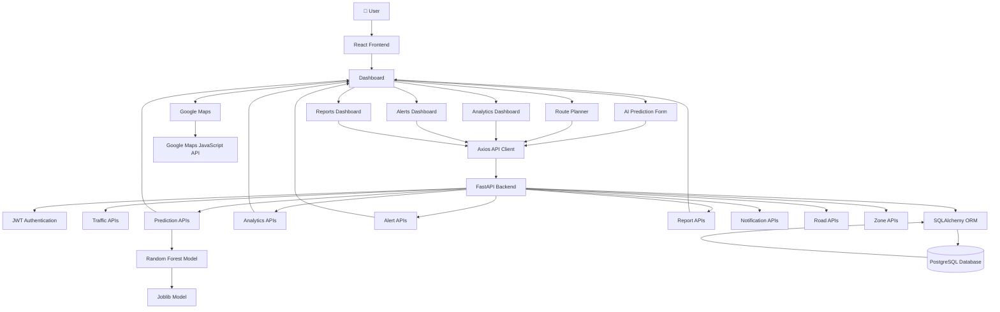

# 🚦 TrafficVision AI

### Smart Traffic Monitoring & Congestion Management System

_A full-stack web application for real-time traffic monitoring, secure user authentication, and intelligent traffic management, built using React, FastAPI, and PostgreSQL._

## 📖 Project Description

TrafficVision AI is a full-stack Smart Traffic Monitoring and Congestion Management System designed to improve urban transportation through Artificial Intelligence, Machine Learning, and real-time traffic analytics.

The project is being developed as part of the Infosys Springboard Internship to simulate a modern Intelligent Transportation System (ITS) capable of monitoring traffic conditions, predicting congestion, recommending optimal travel routes, and assisting commuters and traffic authorities with data-driven decision making.

The system follows a scalable client-server architecture consisting of:

- React + Vite frontend
- FastAPI backend
- PostgreSQL database
- Machine Learning prediction service
- Google Maps Platform integration

Currently, the application provides secure JWT-based authentication, Role-Based Access Control (RBAC), live traffic monitoring, AI-powered congestion prediction using a trained Random Forest Regression model, interactive Google Maps traffic visualization, AI-assisted route recommendation, comprehensive analytics dashboards, historical traffic analytics, intelligent traffic alerts, PDF report generation, AI-generated traffic insights, congestion analytics, route optimization, and real-time administrative monitoring tools.

The machine learning pipeline includes dataset preprocessing, feature engineering, model comparison, hyperparameter tuning, model serialization using Joblib, and deployment through FastAPI REST APIs.

The project continues to evolve with upcoming features including intelligent route optimization, real-time traffic alerts, analytics dashboards, cloud deployment, and large-scale multi-city traffic monitoring.

## 🚧 Project Status

**Completed Milestone:** Milestone 1: Week 1 & 2 — Project Initialization, Design Process & Core Setup

**Completed Milestone:** Milestone 2: Week 3 & 4 — Traffic Prediction & Route Optimization

**Completed Milestone:** Milestone 3: Week 5 & 6 — Alerts, Analytics & AI Insights

---

### ✅ Completed

#### Core System

- Project architecture and folder structure
- Backend setup using FastAPI
- Frontend setup using React (Vite)
- PostgreSQL database integration
- SQLAlchemy ORM configuration
- JWT Authentication
- Role-Based Access Control (RBAC)
- User Registration & Login
- Protected API endpoints
- Frontend–Backend–Database connectivity
- Historical Traffic Analytics Module
- Traffic Alert Management System
- Prediction History Management
- Report Generation System

#### Dashboard

- Live Traffic Monitoring Dashboard
- Traffic Summary Cards
- Traffic Trend Chart
- Live Traffic Data Table
- Dashboard Layout
- Dashboard Components
- Dashboard Refactoring
- Role-specific dashboards
- Public Navigation Bar
- Improved Login UI
- Improved Register UI
- Historical Analytics Dashboard
- Traffic Distribution Dashboard
- Traffic Summary Dashboard
- AI Insights Dashboard
- Alert Monitoring Dashboard
- PDF Report Dashboard

#### Machine Learning

- Dataset Selection
- Data Quality Assessment
- Missing Value Analysis
- Duplicate Analysis
- Exploratory Data Analysis (EDA)
- Feature Engineering
- Data Preprocessing Pipeline
- Decision Tree Model
- Random Forest Model
- Extra Trees Model
- Gradient Boosting Model
- Model Performance Comparison
- Hyperparameter Tuning
- Final Random Forest Model
- Model Serialization using Joblib

#### Artificial Intelligence

- FastAPI Prediction API
- Swagger Prediction Endpoint Testing
- AI Congestion Prediction Dashboard
- Interactive Prediction Form
- AI Prediction Cards
- AI Recommendation Panel
- AI Traffic Alerts
- Prediction History Tracking
- AI Congestion Analytics
- Historical Prediction Analytics
- AI Traffic Insights

#### Google Maps Integration

- Google Maps JavaScript API
- Interactive Traffic Heat Map
- Dynamic Traffic Markers
- Color-coded Congestion Indicators
- Traffic Statistics Cards
- AI Route Planner
- AI Route Recommendation Engine
- 10 Bangalore Traffic Locations
- Dynamic Location Selection
- Intelligent Route Recommendation

#### Development

- Git Version Control
- GitHub Repository
- Modular Folder Structure
- README Documentation
- Report Generation APIs
- Historical Analytics APIs
- Alert Management APIs
- Prediction History APIs
- Modular Service Layer

---

### 🚧 Currently In Progress

- Multi-city Traffic Dataset Expansion
- Advanced Dashboard UI Enhancement
- Responsive Design Improvements
- Performance Optimization
- Cloud Deployment Preparation

---

### 📅 Upcoming Milestones

- Multi-State Traffic Coverage
- Real-Time Traffic Streaming
- Smart Traffic Signal Optimization
- Live Traffic Notifications
- Docker Containerization
- Cloud Deployment
- CI/CD Pipeline
- Multi-City Intelligent Traffic Management

## 🎯 Project Objectives

The primary objectives of TrafficVision AI are:

- Develop a scalable full-stack Smart Traffic Management System.
- Monitor traffic conditions in real time through an interactive dashboard.
- Implement secure user authentication using JWT.
- Enforce Role-Based Access Control (RBAC) for different user roles.
- Build a modular and maintainable backend using FastAPI and SQLAlchemy.
- Integrate a PostgreSQL database for reliable data storage and retrieval.
- Establish seamless communication between the frontend, backend, and database.
- Provide a foundation for future AI-based traffic prediction and route optimization.
- Follow industry-standard software development practices, including Git version control, documentation, and modular project architecture.
- Develop an AI-powered traffic congestion prediction system using Machine Learning.
- Generate intelligent traffic alerts based on congestion prediction thresholds.
- Provide historical traffic analytics for trend analysis and decision making.
- Generate downloadable PDF traffic reports for administrators and traffic authorities.
- Maintain prediction history to support future traffic analysis and model evaluation.
- Deliver AI-driven recommendations and alternate route suggestions to reduce congestion.

## ✨ Features

### ✅ Current Features

### 🔐 Authentication

- JWT Authentication
- OAuth2 Password Flow
- Role-Based Access Control (RBAC)
- User Registration
- User Login
- Protected Routes
- User Profile
- Secure Logout

### 🛠 Backend

- FastAPI REST API
- PostgreSQL database integration
- SQLAlchemy ORM
- Pydantic Validation
- Environment variable configuration using `.env`
- Modular project architecture
- Protected API endpoints
- Traffic Management APIs
- Prediction APIs
- Prediction History APIs
- Analytics APIs
- Alert Management APIs
- Report Generation APIs
- Road Management APIs
- Zone Management APIs
- Notification APIs
- Route Optimization APIs
- Historical Analytics APIs

### 💻 Frontend

- React + Vite application
- React Router navigation
- Axios API integration
- Responsive Dashboard Layout
- Modern Home Page
- Modern Login Page
- Modern Register Page
- Dashboard Components

### 🚦 Traffic Dashboard

- Live Traffic Monitoring
- Traffic Summary Cards
- Traffic Trend Chart
- Live Traffic Data Table
- Dashboard Layout
- Dashboard Header
- Dashboard Cards
- Dashboard Content
- Role-specific Dashboards
- Historical Analytics Dashboard
- Traffic Analytics Summary
- Congestion Distribution
- Traffic Trend Analytics
- AI Insights Dashboard
- Prediction History
- Traffic Alerts Panel
- Report Download

### 🤖 Artificial Intelligence

- Random Forest Congestion Prediction
- Machine Learning Prediction API
- AI Congestion Prediction Dashboard
- Interactive Prediction Form
- Live Prediction Results
- AI Recommendation Panel
- Prediction Confidence Score
- Alternate Route Recommendation
- AI Traffic Insights
- Prediction History Tracking

### 🗺️ Google Maps

- Interactive Google Map
- Color-coded Traffic Markers
- Live Congestion Visualization
- AI Route Planner
- Origin & Destination Selection
- Intelligent Route Recommendation
- Traffic Heat Map
- Traffic Statistics Cards
- 10 Smart Traffic Locations

### 🧠 Machine Learning

- Dataset Cleaning
- Data Quality Assessment
- Feature Engineering
- Data Preprocessing
- Model Training
- Model Comparison
- Hyperparameter Tuning
- Random Forest Model
- FastAPI Prediction API
- Joblib Model Deployment
- Prediction History Storage
- Real-time Inference
- AI Recommendation Generation
- Model Deployment with FastAPI

### ⚙ Development

- Git Version Control
- GitHub Repository
- Modular Folder Structure
- README Documentation
- Swagger API Documentation
- Service Layer Architecture
- Modular Router Architecture
- Analytics Module
- Reports Module
- Alerts Module
- Notification Module

---

### 🚀 Planned Features

- Live Sensor Integration
- Multi-city Traffic Expansion
- Docker Containerization
- Cloud Deployment
- CI/CD Pipeline

## 🛠️ Technology Stack

| Category              | Technologies                                |
| --------------------- | ------------------------------------------- |
| **Frontend**          | React, Vite, React Router, Axios            |
| **Backend**           | FastAPI, SQLAlchemy, Pydantic               |
| **Database**          | PostgreSQL                                  |
| **Authentication**    | JWT, OAuth2 Password Flow, Passlib (bcrypt) |
| **Machine Learning**  | Scikit-learn, Pandas, NumPy, Joblib         |
| **Visualization**     | Google Maps JavaScript API, Recharts        |
| **Reports**           | ReportLab (PDF Generation)                  |
| **API Documentation** | Swagger UI, ReDoc                           |
| **Development Tools** | Git, GitHub, VS Code, pgAdmin               |
| **Configuration**     | Python Virtual Environment, python-dotenv   |

## 📊 Machine Learning Workflow

TrafficVision AI follows a complete end-to-end Machine Learning pipeline for intelligent traffic congestion prediction and AI-assisted route recommendation.

1. Dataset Collection
2. Data Quality Assessment
3. Exploratory Data Analysis (EDA)
4. Missing Value Handling
5. Duplicate Data Removal
6. Feature Engineering
7. Data Preprocessing
8. Model Training
9. Model Comparison
10. Hyperparameter Tuning
11. Final Random Forest Model Selection
12. Model Serialization using Joblib
13. FastAPI Prediction API Development
14. Swagger API Testing
15. React Prediction Dashboard Integration
16. Google Maps Integration
17. AI Traffic Heat Map
18. Color-coded Congestion Visualization
19. AI Route Planner
20. AI Route Recommendation Engine
21. Travel Time Estimation
22. Delay Prediction
23. AI Confidence & Route Quality Analysis
24. Multi-location Traffic Prediction
25. Prediction History Storage
26. Historical Traffic Analytics
27. Traffic Alert Generation
28. AI Traffic Insights Generation
29. Traffic Report Generation (PDF)
30. Route Optimization API
31. Notification Management
32. Road & Zone Management
33. Analytics Dashboard Integration
34. End-to-End AI Traffic Management Workflow

## 🏗️ System Architecture



## 📁 Project Structure

```text
trafficvision-ai-smart-traffic-prediction/
│
├── analysis/
│   ├── datasets/
│   │   ├── raw/
│   │   │   └── Banglore_traffic_Dataset.csv        # Original traffic dataset
│   │   └── processed/
│   │       └── traffic_processed.csv               # Preprocessed dataset
│   │
│   ├── models/
│   │   └── best_model.pkl                          # Trained Random Forest model
│   │
│   ├── notebooks/
│   │   ├── 00_environment_setup.ipynb              # Environment setup
│   │   ├── 01_dataset_evaluator.ipynb              # Dataset quality assessment
│   │   ├── 02_eda.ipynb                            # Exploratory Data Analysis
│   │   ├── 03_feature_engineering.ipynb            # Feature engineering
│   │   ├── 04_preprocessing.ipynb                  # Data preprocessing
│   │   ├── 05_model_training.ipynb                 # Model training
│   │   ├── 06_model_comparison.ipynb               # Model comparison
│   │   └── 07_hyperparameter_tuning.ipynb          # Hyperparameter tuning
│   │
│   ├── src/
│   │   ├── eda.py                                  # EDA helper functions
│   │   ├── feature_engineering.py                  # Feature engineering
│   │   ├── preprocessing.py                        # Data preprocessing
│   │   └── quality.py                              # Dataset quality utilities
│
├── backend/
│   ├── app/
│   │   ├── config/
│   │   │   └── auth.py                             # JWT configuration
│   │   │
│   │   ├── constants/
│   │   │   └── roles.py                            # User role definitions
│   │   │
│   │   ├── database/
│   │   │   ├── base.py                             # SQLAlchemy base
│   │   │   └── connection.py                       # Database connection
│   │   │
│   │   ├── dependencies/
│   │   │   └── auth.py                             # Authentication dependencies
│   │   │
│   │   ├── ml/
│   │   │   ├── best_model.pkl                      # ML model
│   │   │   └── predictor.py                        # Prediction engine
│   │   │
│   │   ├── models/
│   │   │   ├── alert.py                            # Alert model
│   │   │   ├── notification.py                     # Notification model
│   │   │   ├── prediction_history.py               # Prediction history model
│   │   │   ├── report.py                           # Report model
│   │   │   ├── road.py                             # Road model
│   │   │   ├── traffic.py                          # Traffic model
│   │   │   ├── user.py                             # User model
│   │   │   └── zone.py                             # Zone model
│   │   │
│   │   ├── routers/
│   │   │   ├── alerts.py                           # Alert APIs
│   │   │   ├── analytics.py                        # Analytics APIs
│   │   │   ├── history.py                          # History APIs
│   │   │   ├── notifications.py                    # Notification APIs
│   │   │   ├── prediction.py                       # AI Prediction APIs
│   │   │   ├── prediction_history.py               # Prediction history APIs
│   │   │   ├── reports.py                          # Report APIs
│   │   │   ├── roads.py                            # Road management APIs
│   │   │   ├── routes.py                           # Route recommendation APIs
│   │   │   ├── traffic.py                          # Traffic APIs
│   │   │   ├── user.py                             # User APIs
│   │   │   └── zones.py                            # Zone APIs
│   │   │
│   │   ├── schemas/
│   │   │   ├── alert.py                               # Alert request & response schemas
│   │   │   ├── notification.py                        # Notification schemas
│   │   │   ├── prediction.py                          # Prediction request & response schemas
│   │   │   ├── prediction_history.py                  # Prediction history schemas
│   │   │   ├── report.py                              # Report schemas
│   │   │   ├── road.py                                # Road management schemas
│   │   │   ├── traffic.py                             # Traffic data schemas
│   │   │   ├── user.py                                # User authentication & profile schemas
│   │   │   └── zone.py                                # Zone management schemas
│   │   │
│   │   ├── services/
│   │   │   ├── alert_service.py                       # Alert business logic
│   │   │   ├── analytics_service.py                   # Analytics calculations & statistics
│   │   │   ├── history_service.py                     # Historical traffic data service
│   │   │   ├── notification_service.py                # Notification management service
│   │   │   ├── prediction_history_service.py          # Prediction history management
│   │   │   ├── report_service.py                      # Report generation service
│   │   │   ├── road_service.py                        # Road management service
│   │   │   ├── route_service.py                       # Route optimization service
│   │   │   ├── traffic_service.py                     # Live traffic management service
│   │   │   └── zone_service.py
│   │   │
│   │   ├── utils/
│   │   │   ├── pdf_generator.py                    # PDF report generation
│   │   │   └── security.py                         # JWT & password hashing
│   │   │
│   │   └── main.py                                 # FastAPI application
│   │
│   ├── .env                                           # Backend environment variables
│   ├── .env.example                                   # Sample backend configuration
│   ├── requirements.txt                               # Python backend dependencies
│   └── simulator.py                                # Traffic data simulator
│
├── frontend/
│   ├── public/
│   │   ├── favicon.svg                                # Website favicon
│   │   └── icons.svg                                  # SVG icon collection
│   │
│   ├── src/
│   │   ├── assets/
│   │   │   ├── hero.png                               # Homepage hero image
│   │   │   ├── react.svg                              # React logo
│   │   │   └── vite.svg                               # Vite logo
│   │   │
│   │   ├── components/
│   │   │   ├── alerts/
│   │   │   │   └── AlertCard.jsx                      # Alert display component
│   │   │   │
│   │   │   ├── analytics/
│   │   │   │   ├── AIInsights.jsx                     # AI-generated traffic insights
│   │   │   │   ├── AnalyticsCard.jsx                  # Analytics summary card
│   │   │   │   ├── BusyRoadChart.jsx                  # Busy roads visualization
│   │   │   │   ├── CongestionPieChart.jsx             # Congestion distribution chart
│   │   │   │   ├── RoadRankingTable.jsx               # Road ranking table
│   │   │   │   └── TrafficTrendChart.jsx              # Traffic trend visualization
│   │   │   │
│   │   │   ├── common/
│   │   │   │   └── NotificationPanel.jsx              # Notification panel component
│   │   │   │
│   │   │   ├── dashboard/
│   │   │   │   ├── AdminLayout.jsx                    # Admin dashboard layout
│   │   │   │   ├── DashboardCards.jsx                 # Dashboard statistics cards
│   │   │   │   ├── DashboardContent.jsx               # Dashboard main content
│   │   │   │   ├── DashboardHeader.jsx                # Dashboard header
│   │   │   │   ├── DashboardLayout.jsx                # Common dashboard layout
│   │   │   │   ├── PredictionPanel.jsx                # AI prediction interface
│   │   │   │   ├── RoutePlanner.jsx                   # Route planning component
│   │   │   │   ├── RouteRecommendation.jsx            # AI route recommendations
│   │   │   │   └── TrafficMap.jsx                     # Interactive traffic map
│   │   │   │
│   │   │   ├── roads/
│   │   │   │   ├── RoadCard.jsx                       # Road information card
│   │   │   │   └── RoadForm.jsx                       # Road management form
│   │   │   │
│   │   │   ├── zones/
│   │   │   │   ├── ZoneCard.jsx                       # Zone information card
│   │   │   │   └── ZoneForm.jsx                       # Zone management form
│   │   │   │
│   │   │   ├── FeaturesSection.jsx                    # Homepage features section
│   │   │   ├── HeroSection.jsx                        # Homepage hero banner
│   │   │   ├── HowItWorksSection.jsx                  # Workflow explanation section
│   │   │   ├── Navbar.jsx                             # Dashboard navigation bar
│   │   │   ├── ProtectedRoute.jsx                     # Authentication route protection
│   │   │   ├── PublicNavbar.jsx                       # Public website navigation
│   │   │   ├── RoleProtectedRoute.jsx                 # Role-based access protection
│   │   │   ├── Sidebar.jsx                            # Dashboard sidebar
│   │   │   ├── TrafficCard.jsx                        # Traffic summary card
│   │   │   ├── TrafficChart.jsx                       # Live traffic chart
│   │   │   └── TrafficTable.jsx                       # Traffic information table
│   │   │
│   │   ├── pages/
│   │   │   ├── admin/
│   │   │   │   ├── Alerts.jsx                         # Alert management page
│   │   │   │   ├── Analytics.jsx                      # Analytics dashboard
│   │   │   │   ├── Dashboard.jsx                      # Admin dashboard
│   │   │   │   ├── HistoricalAnalytics.jsx            # Historical traffic analytics
│   │   │   │   ├── Reports.jsx                        # Reports page
│   │   │   │   ├── RoadManagement.jsx                 # Road management page
│   │   │   │   ├── RouteOptimization.jsx              # Route optimization page
│   │   │   │   ├── Settings.jsx                       # System settings page
│   │   │   │   ├── TrafficMonitoring.jsx              # Live traffic monitoring
│   │   │   │   └── ZoneManagement.jsx                 # Zone management page
│   │   │   │
│   │   │   ├── commuter/
│   │   │   │   └── Dashboard.jsx                      # Commuter dashboard
│   │   │   │
│   │   │   ├── operator/
│   │   │   │   ├── Dashboard.jsx                      # Traffic operator dashboard
│   │   │   │   └── Prediction.jsx                     # Prediction page
│   │   │   │
│   │   │   ├── Home.jsx                               # Landing page
│   │   │   ├── Login.jsx                              # User login page
│   │   │   └── Register.jsx                           # User registration page
│   │   │
│   │   ├── services/
│   │   │   ├── alerts.js                              # Alert API service
│   │   │   ├── analytics.js                           # Analytics API service
│   │   │   ├── api.js                                 # Axios configuration
│   │   │   ├── auth.js                                # Authentication API
│   │   │   ├── history.js                             # Historical data API service
│   │   │   ├── mapPrediction.js                       # Google Maps prediction API service
│   │   │   ├── notifications.js                       # Notification API service
│   │   │   ├── prediction.js                          # Prediction API service
│   │   │   ├── predictionHistory.js                   # Prediction history API service
│   │   │   ├── report.js                              # Report API service
│   │   │   ├── roads.js                               # Road management API service
│   │   │   ├── routes.js                              # Route optimization API service
│   │   │   ├── traffic.js                             # Traffic monitoring API service
│   │   │   ├── user.js                                # User API service
│   │   │   └── zones.js                               # Zone management API service
│   │   │
│   │   ├── styles/
│   │   │   ├── chart.css                              # Charts styling
│   │   │   ├── global.css                             # Global application styles
│   │   │   ├── HeroSection.css                        # Hero section styles
│   │   │   ├── Home.css                               # Homepage styles
│   │   │   ├── HowItWorks.css                         # Workflow section styles
│   │   │   ├── Login.css                              # Login page styles
│   │   │   ├── map.css                                # Interactive map styles
│   │   │   ├── navbar.css                             # Navigation bar styles
│   │   │   ├── prediction.css                         # Prediction page styles
│   │   │   ├── Register.css                           # Registration page styles
│   │   │   ├── sidebar.css                            # Sidebar styles
│   │   │   ├── trafficcard.css                        # Traffic card styles
│   │   │   └── traffictable.css                       # Traffic table styles
│   │   │
│   │   ├── App.jsx                                    # Root React component
│   │   └── main.jsx                                   # React application entry point
│   │
│   ├── .env                                           # Frontend environment variables
│   ├── .gitignore                                     # Frontend Git ignore rules
│   ├── eslint.config.js                               # ESLint configuration
│   ├── index.html                                     # HTML entry page
│   ├── package.json                                   # Frontend dependencies
│   ├── package-lock.json                              # Locked dependency versions
│   └── vite.config.js                                 # Vite configuration
│
├── .gitignore                                         # Repository ignore rules
├── LICENSE                                            # MIT License
├── project_structure.txt                              # Project directory snapshot
└── README.md
```

## 🚀 Getting Started

Follow the steps below to set up and run **TrafficVision AI** on your local machine.

### 📋 Prerequisites

Before running the project, ensure the following software is installed on your system.

| Software           | Recommended Version |
| ------------------ | ------------------- |
| Python             | 3.12 or later       |
| Node.js            | 20.x LTS or later   |
| PostgreSQL         | 16 or later         |
| Git                | Latest Version      |
| Visual Studio Code | Latest Version      |

### Recommended VS Code Extensions

- Python
- Pylance
- ESLint
- Prettier
- PostgreSQL (optional)

---

### ⚙️ Backend Setup

1. Clone the repository.

```bash
git clone https://github.com/springboardmentor620-ai/trafficvision-ai-smart-traffic-prediction.git
```

2. Navigate into the project directory.

```bash
cd trafficvision-ai-smart-traffic-prediction
```

3. Navigate to the backend folder.

```bash
cd backend
```

4. Create a Python virtual environment.

```bash
python -m venv venv
```

5. Activate the virtual environment.

**Windows (PowerShell)**

```powershell
venv\Scripts\Activate.ps1
```

**Windows (Command Prompt)**

```cmd
venv\Scripts\activate
```

**Linux/macOS**

```bash
source venv/bin/activate
```

6. Install backend dependencies.

```bash
pip install -r requirements.txt
```

---

### 🗄️ Database Setup

1. Start PostgreSQL.

2. Create a new database.

```sql
CREATE DATABASE trafficvision_db;
```

3. Verify the database using **pgAdmin** or the PostgreSQL terminal.

4. Configure the backend `.env` file.

Example:

```env
DATABASE_URL=postgresql://<username>:<password>@localhost:5432/trafficvision_db
SECRET_KEY=your_secret_key_here
ALGORITHM=HS256
ACCESS_TOKEN_EXPIRE_MINUTES=30
```

5. Database tables will be created automatically when the FastAPI server starts for the first time.

---

### 💻 Frontend Setup

Open another terminal.

Navigate to the frontend folder.

```bash
cd frontend
```

Install dependencies.

```bash
npm install
```

Run the development server.

```bash
npm run dev
```

Open your browser.

```text
http://localhost:5173
```

---

### 🔐 Environment Variables

Backend (`backend/.env`)

```env
DATABASE_URL=postgresql://<username>:<password>@localhost:5432/trafficvision_db
SECRET_KEY=your_secret_key_here
ALGORITHM=HS256
ACCESS_TOKEN_EXPIRE_MINUTES=30
```

Frontend (`frontend/.env`)

```env
VITE_API_URL=http://localhost:8000
```

> **Important:** Never commit your `.env` files. They are already excluded using `.gitignore`.

---

### ▶️ Running the Application

Start the backend.

```bash
cd backend
python -m uvicorn app.main:app --reload
```

Backend URL

```text
http://localhost:8000
```

Start the frontend.

```bash
cd frontend
npm run dev
```

Frontend URL

```text
http://localhost:5173
```

Once both services are running, open:

```text
http://localhost:5173
```

---

### 📖 API Documentation

FastAPI automatically generates API documentation.

#### Swagger UI

```text
http://localhost:8000/docs
```

#### ReDoc

```text
http://localhost:8000/redoc
```

The documentation allows you to:

- View available APIs
- Test endpoints directly
- Inspect request and response schemas
- Verify JWT authentication
- Explore backend services

## 🌐 API Overview

The TrafficVision AI backend provides REST APIs for authentication, user management, traffic prediction, traffic monitoring, analytics, alerts, notifications, reports, roads, routes, zones, and prediction history.

### 🔐 Authentication APIs

| Method | Endpoint    | Access | Description                                         |
| ------ | ----------- | ------ | --------------------------------------------------- |
| POST   | `/register` | Public | Register a new user                                 |
| POST   | `/login`    | Public | Authenticate a user and generate a JWT access token |

---

### 👤 User APIs

| Method | Endpoint | Access        | Description                                     |
| ------ | -------- | ------------- | ----------------------------------------------- |
| GET    | `/me`    | Authenticated | Retrieve the currently logged-in user's profile |
| GET    | `/users` | Admin Only    | Retrieve the list of registered users           |

---

### 🤖 Prediction APIs

| Method | Endpoint              | Access        | Description                                                         |
| ------ | --------------------- | ------------- | ------------------------------------------------------------------- |
| POST   | `/prediction/predict` | Authenticated | Predict traffic congestion using the trained machine learning model |

---

### 🚦 Traffic APIs

| Method | Endpoint           | Access        | Description                             |
| ------ | ------------------ | ------------- | --------------------------------------- |
| GET    | `/traffic/live`    | Authenticated | Retrieve current traffic information    |
| GET    | `/traffic/history` | Authenticated | Retrieve historical traffic information |

---

### 🗺️ Zone APIs

| Method | Endpoint           | Access           | Description            |
| ------ | ------------------ | ---------------- | ---------------------- |
| GET    | `/zones`           | Authenticated    | Retrieve traffic zones |
| POST   | `/zones`           | Admin/Authorized | Create a traffic zone  |
| PUT    | `/zones/{zone_id}` | Admin/Authorized | Update a traffic zone  |
| DELETE | `/zones/{zone_id}` | Admin/Authorized | Delete a traffic zone  |

---

### 🛣️ Road APIs

| Method | Endpoint           | Access           | Description               |
| ------ | ------------------ | ---------------- | ------------------------- |
| GET    | `/roads`           | Authenticated    | Retrieve registered roads |
| POST   | `/roads`           | Admin/Authorized | Create a road             |
| PUT    | `/roads/{road_id}` | Admin/Authorized | Update a road             |
| DELETE | `/roads/{road_id}` | Admin/Authorized | Delete a road             |

---

### 🚨 Alert APIs

| Method | Endpoint             | Access        | Description             |
| ------ | -------------------- | ------------- | ----------------------- |
| GET    | `/alerts`            | Authenticated | Retrieve traffic alerts |
| POST   | `/alerts`            | Authorized    | Create a traffic alert  |
| PUT    | `/alerts/{alert_id}` | Authorized    | Update an alert         |
| DELETE | `/alerts/{alert_id}` | Authorized    | Delete an alert         |

---

### 🔔 Notification APIs

| Method | Endpoint                           | Access        | Description                 |
| ------ | ---------------------------------- | ------------- | --------------------------- |
| GET    | `/notifications`                   | Authenticated | Retrieve user notifications |
| PUT    | `/notifications/{notification_id}` | Authenticated | Update notification status  |

---

### 📊 Analytics APIs

| Method | Endpoint     | Access        | Description                |
| ------ | ------------ | ------------- | -------------------------- |
| GET    | `/analytics` | Authenticated | Retrieve traffic analytics |

---

### 📜 Prediction History APIs

| Method | Endpoint              | Access        | Description                             |
| ------ | --------------------- | ------------- | --------------------------------------- |
| GET    | `/prediction-history` | Authenticated | Retrieve previous AI prediction records |
| POST   | `/prediction-history` | Authenticated | Store a prediction result               |

---

### 📈 History APIs

| Method | Endpoint   | Access        | Description                         |
| ------ | ---------- | ------------- | ----------------------------------- |
| GET    | `/history` | Authenticated | Retrieve historical traffic records |

---

### 🧭 Route APIs

| Method | Endpoint  | Access        | Description                           |
| ------ | --------- | ------------- | ------------------------------------- |
| POST   | `/routes` | Authenticated | Generate or process route information |
| GET    | `/routes` | Authenticated | Retrieve available route information  |

---

### 📄 Report APIs

| Method | Endpoint   | Access        | Description                        |
| ------ | ---------- | ------------- | ---------------------------------- |
| GET    | `/reports` | Authenticated | Retrieve generated traffic reports |
| POST   | `/reports` | Authorized    | Generate a traffic report          |

---

### 📚 API Documentation

For the complete list of available endpoints, request parameters, response schemas, authentication requirements, and interactive testing, use the automatically generated FastAPI documentation:

**Swagger UI**

```text
http://localhost:8000/docs
```

**ReDoc**

```text
http://localhost:8000/redoc
```

These interfaces allow you to:

- View all available API endpoints.
- Test APIs directly from the browser.
- Inspect request and response schemas.
- Verify authentication and authorization workflows.
- Test protected endpoints using JWT authentication.
- Review API request parameters and response formats.
  Note: The Swagger UI documentation reflects the actual routes registered by the running FastAPI application.

## 📅 Development Progress

```md
## 📅 Development Progress

The development of **TrafficVision AI** has been carried out in multiple phases, with each phase focusing on a major aspect of the system before progressing to the next.

---

### 🚀 Phase 1: Project Initialization

**Status: ✅ Completed**

- Selected the project technology stack.
- Created the GitHub repository.
- Designed the overall project architecture.
- Configured the development environment.
- Installed Python, PostgreSQL, pgAdmin, Node.js, and Git.
- Created the frontend and backend folder structure.
- Created Python virtual environments.
- Installed backend and frontend dependencies.

---

### 🗄️ Phase 2: Backend & Database Development

**Status: ✅ Completed**

- Developed the FastAPI backend.
- Connected FastAPI with PostgreSQL.
- Configured SQLAlchemy ORM.
- Created database models.
- Configured database connectivity.
- Implemented automatic database table creation.
- Developed REST APIs.
- Created backend services for traffic, zones, roads, routes, alerts, notifications, analytics, reports, and prediction history.
- Tested backend APIs.

---

### 🔐 Phase 3: Authentication & Authorization

**Status: ✅ Completed**

- User Registration.
- User Login.
- Password Hashing using bcrypt.
- JWT Authentication.
- OAuth2 Password Flow.
- Role-Based Access Control (RBAC).
- Protected API Endpoints.
- Token Validation.
- Authentication Dependencies.
- Role-specific route protection.
- Logout Functionality.

---

### 💻 Phase 4: Frontend Development

**Status: ✅ Completed**

- Created the React application using Vite.
- Configured React Router.
- Integrated Axios for API communication.
- Implemented Protected Routes.
- Implemented Role Protected Routes.
- Created Public Navigation Bar.
- Created Dashboard Navigation.
- Created Sidebar Navigation.
- Developed Login and Registration pages.
- Connected frontend services with backend APIs.
- Implemented JWT token handling.
- Implemented role-based frontend navigation.
- Added responsive UI styling.

---

### 📊 Phase 5: Dashboard Development

**Status: ✅ Completed**

- Designed the dashboard layout.
- Created dashboard cards.
- Added dashboard header.
- Integrated live traffic APIs.
- Added traffic summary cards.
- Added traffic trend visualization.
- Added live traffic data table.
- Added traffic map visualization.
- Added notification panel.
- Implemented dashboard layouts for different user roles.
- Displayed authenticated user information.
- Refactored dashboard components into reusable React components.

---

### 🤖 Phase 6: AI & Machine Learning

**Status: ✅ Completed**

- Dataset evaluation.
- Data quality assessment.
- Exploratory Data Analysis (EDA).
- Data cleaning.
- Feature engineering.
- Data preprocessing.
- Created preprocessing utilities.
- Trained Random Forest model.
- Trained Decision Tree model.
- Trained Extra Trees model.
- Trained Gradient Boosting model.
- Compared machine learning models.
- Performed hyperparameter tuning.
- Selected the best-performing model.
- Serialized the trained model using Joblib.
- Integrated the trained model with FastAPI.
- Created the prediction engine.
- Created the prediction API.
- Tested predictions through Swagger UI.

---

### 🗺️ Phase 7: Traffic Visualization & Route Recommendation

**Status: ✅ Completed**

- Google Maps integration.
- AI congestion prediction panel.
- Interactive traffic map.
- Color-coded traffic markers.
- Live traffic information windows.
- Multiple Bangalore traffic zones.
- Traffic congestion visualization.
- Route planner.
- Route recommendation interface.
- AI-based route recommendation.
- Frontend prediction integration.
- Road and zone management interfaces.

---

### 🚧 Phase 8: Upcoming Features

**Status: 🔄 Planned**

- Route Optimization Engine.
- Live Traffic Streaming.
- Advanced Analytics Dashboard.
- Historical Traffic Reports.
- Notifications and alert improvements.
- Docker Deployment.
- Cloud Deployment.
- Production monitoring.

## 🛠️ Problems Faced & Solutions

During the development of TrafficVision AI, several technical challenges were encountered and resolved. Documenting these issues helps future contributors understand the development process and provides troubleshooting guidance.

| Problem                                                      | Solution                                                                                                                       |
| ------------------------------------------------------------ | ------------------------------------------------------------------------------------------------------------------------------ |
| Python environment setup and PATH configuration              | Installed Python correctly, configured the virtual environment, and verified the Python installation.                          |
| PostgreSQL connection issues                                 | Configured PostgreSQL correctly and verified the database connection before integrating it with FastAPI.                       |
| SQLAlchemy database configuration                            | Organized the database layer into a dedicated module and configured session management.                                        |
| Missing database driver (`psycopg`)                          | Installed the required PostgreSQL driver and updated the database connection string.                                           |
| Environment variable management                              | Moved sensitive configuration values to a `.env` file using `python-dotenv`.                                                   |
| CORS errors between React and FastAPI                        | Configured FastAPI CORS middleware to allow frontend requests during development.                                              |
| OAuth2 authentication (422 Validation Error)                 | Updated the frontend login request to use the correct `OAuth2PasswordRequestForm` format.                                      |
| JWT authentication issues                                    | Implemented secure token generation, validation, and protected API endpoints.                                                  |
| Frontend–Backend communication                               | Configured Axios with a reusable API service and verified backend connectivity.                                                |
| Dashboard data integration                                   | Replaced static frontend data with live data retrieved from backend APIs.                                                      |
| Large dashboard component became difficult to maintain       | Refactored the dashboard into reusable React components following component-based architecture.                                |
| Machine learning model accuracy                              | Compared multiple ML models and selected Random Forest after hyperparameter tuning.                                            |
| Feature engineering complexity                               | Created a reusable preprocessing pipeline.                                                                                     |
| Integrating ML model with FastAPI                            | Serialized model using Joblib and created prediction endpoint.                                                                 |
| Google Maps integration                                      | Configured Maps API and rendered interactive traffic markers.                                                                  |
| Dynamic traffic visualization                                | Implemented color-coded congestion markers and info windows.                                                                   |
| Route recommendation logic                                   | Built AI-based route planner using congestion predictions.                                                                     |
| Responsive dashboard layout                                  | Improved UI using reusable CSS and flexible layouts.                                                                           |
| Missing Python packages during backend development           | Installed the required packages inside the backend virtual environment and verified the dependency installation.               |
| `uvicorn` command not recognized                             | Ran Uvicorn through the active Python environment using `python -m uvicorn`.                                                   |
| `bcrypt` compatibility error                                 | Resolved the package compatibility issue and verified password hashing functionality.                                          |
| FastAPI indentation and syntax errors                        | Corrected Python indentation, imports, function definitions, and router structure.                                             |
| Frontend blank page after modifying React files              | Restored the required React imports, component structure, and application entry-point configuration.                           |
| Vite development server errors                               | Corrected frontend imports, dependencies, and component references before restarting the development server.                   |
| React component import/export errors                         | Corrected component exports, imports, and file paths to match the React project structure.                                     |
| JWT token not included in protected requests                 | Configured the Axios API layer to attach the JWT access token to authenticated requests.                                       |
| Authentication state lost after page refresh                 | Restored the authenticated user state using the stored authentication token and user information.                              |
| Live traffic information required automatic updates          | Implemented periodic data refresh to keep dashboard traffic information updated.                                               |
| Traffic chart organization became difficult                  | Created dedicated reusable chart components and separated chart-specific styling from the main dashboard.                      |
| Traffic table data required consistent API mapping           | Standardized traffic data handling between backend API responses and frontend traffic components.                              |
| ML model input features differed from training data          | Standardized feature engineering and preprocessing between model training and prediction.                                      |
| ML model loading in the backend                              | Integrated the serialized model into the backend ML module and created a dedicated prediction loader.                          |
| Route planning required congestion information               | Connected route planning with congestion prediction results to support traffic-aware recommendations.                          |
| Increasing number of API services became difficult to manage | Organized frontend API communication into separate service modules for different application features.                         |
| Growing number of pages increased navigation complexity      | Organized frontend pages according to Admin, Traffic Operator, and Commuter roles.                                             |
| Local development files appeared in the project              | Updated Git ignore rules to exclude virtual environments, cache files, environment files, and generated development files.     |
| Large frontend dependency directory should not be committed  | Excluded `node_modules` from version control while retaining `package.json` and `package-lock.json` for dependency management. |
| Project architecture became difficult to document            | Maintained `project_structure.txt` and updated the README with the current project architecture.                               |

## 🧪 Testing

The following components have been tested during development to verify that the TrafficVision AI application works correctly across the backend, database, authentication, frontend, machine learning, traffic visualization, and route recommendation modules.

| Component                    | Status    | Testing Method                                                            |
| ---------------------------- | --------- | ------------------------------------------------------------------------- |
| Backend API                  | ✅ Passed | Tested using FastAPI Swagger UI (`/docs`)                                 |
| PostgreSQL Database          | ✅ Passed | Verified database connectivity, table creation, and CRUD operations       |
| User Registration            | ✅ Passed | Successfully created and stored new user accounts                         |
| User Login                   | ✅ Passed | Verified authentication and JWT access token generation                   |
| JWT Authentication           | ✅ Passed | Verified token validation and authenticated API requests                  |
| Protected Routes             | ✅ Passed | Verified unauthenticated users cannot access protected resources          |
| Role-Based Access Control    | ✅ Passed | Tested Admin, Traffic Operator, and Commuter role permissions             |
| Frontend–Backend Integration | ✅ Passed | Verified Axios communication between React and FastAPI                    |
| Dashboard                    | ✅ Passed | Verified dashboard loading and traffic data presentation                  |
| Role-Based Dashboards        | ✅ Passed | Verified Admin, Traffic Operator, and Commuter dashboard access           |
| Live Traffic Data            | ✅ Passed | Verified traffic data retrieval and display in dashboard components       |
| Traffic Charts               | ✅ Passed | Verified traffic trend and congestion visualizations                      |
| Traffic Data Table           | ✅ Passed | Verified traffic records are displayed correctly                          |
| Zone Management              | ✅ Passed | Tested zone creation, retrieval, update, and management workflows         |
| Road Management              | ✅ Passed | Tested road management and road-related API operations                    |
| Traffic Prediction API       | ✅ Passed | Verified congestion prediction requests and responses                     |
| ML Model Integration         | ✅ Passed | Verified loading and inference using the serialized Random Forest model   |
| Prediction History           | ✅ Passed | Verified prediction results are stored and retrieved correctly            |
| Analytics                    | ✅ Passed | Verified analytics data retrieval and dashboard visualization             |
| Historical Traffic Analytics | ✅ Passed | Verified historical traffic data retrieval and analysis                   |
| Alerts                       | ✅ Passed | Verified traffic alert creation, retrieval, and display                   |
| Notifications                | ✅ Passed | Verified notification retrieval and frontend notification panel           |
| Reports                      | ✅ Passed | Verified report generation and report-related API functionality           |
| Google Maps Integration      | ✅ Passed | Verified interactive map rendering and traffic location display           |
| Traffic Heat Map             | ✅ Passed | Verified color-coded congestion visualization on the map                  |
| Traffic Information Windows  | ✅ Passed | Verified traffic information display for map markers                      |
| Route Planner                | ✅ Passed | Tested origin and destination selection and route planning workflow       |
| AI Route Recommendation      | ✅ Passed | Verified route recommendations using traffic congestion information       |
| Authentication Flow          | ✅ Passed | Verified login, token storage, protected routes, and logout functionality |
| Responsive Dashboard Layout  | ✅ Passed | Tested dashboard layout across different screen sizes and resolutions     |

## 🗺️ Roadmap

The following enhancements are planned for future phases of TrafficVision AI:

### 🎨 User Interface

- Dark Mode Support
- Mobile Responsive Improvements
- Advanced Dashboard Customization
- Accessibility Improvements
- Enhanced User Experience and Navigation

### 🚦 Traffic Management

- Real-Time Traffic Sensor Integration
- Live Traffic Streaming using WebSockets
- Advanced Incident Reporting
- Automated Traffic Alert Generation
- Advanced Zone and Road Monitoring
- Historical Traffic Pattern Monitoring

### 🤖 Artificial Intelligence

- Real-Time Congestion Prediction
- Advanced Traffic Forecasting
- Travel Time Prediction
- Smart Route Optimization
- Adaptive Route Recommendation
- Advanced Traffic Pattern Analysis
- Continuous Model Retraining with New Traffic Data

### 📊 Analytics & Reporting

- Advanced Historical Traffic Analytics
- Interactive Analytics Filters
- Advanced AI-Generated Traffic Insights
- Automated Report Scheduling
- Export Reports in Additional Formats
- Comparative Traffic Analysis

### ☁️ Deployment & DevOps

- Docker Containerization
- Cloud Deployment
- CI/CD Pipeline
- Production Environment Configuration
- Automated Database Backups
- Application Monitoring and Logging

### 🔒 Security & Performance

- Refresh Token Authentication
- Rate Limiting
- Advanced API Monitoring
- Database Query Optimization
- Caching for Frequently Requested Traffic Data
- Security Hardening and Production Authentication Configuration

## 📄 License

This project is licensed under the **MIT License**.

You are free to use, modify, and distribute this project in accordance with the terms of the license.

For more information, see the [LICENSE](LICENSE) file.

## 🙏 Acknowledgements

This project has been developed as part of an internship to gain practical experience in full-stack web development, artificial intelligence, machine learning, database management, and modern software engineering practices.

Special thanks to:

- The internship mentors for providing project guidance, technical requirements, and continuous support.
- The open-source community for maintaining the libraries, frameworks, and development tools used in this project.
- The developers and maintainers of FastAPI, React, PostgreSQL, SQLAlchemy, Vite, and other open-source technologies used throughout the application.
- The contributors and maintainers of the Python machine learning ecosystem that supported dataset processing, model development, training, evaluation, and inference.
- OpenAI ChatGPT for technical guidance, debugging assistance, architecture discussions, problem-solving, and documentation support throughout the development process.
```

```

```
